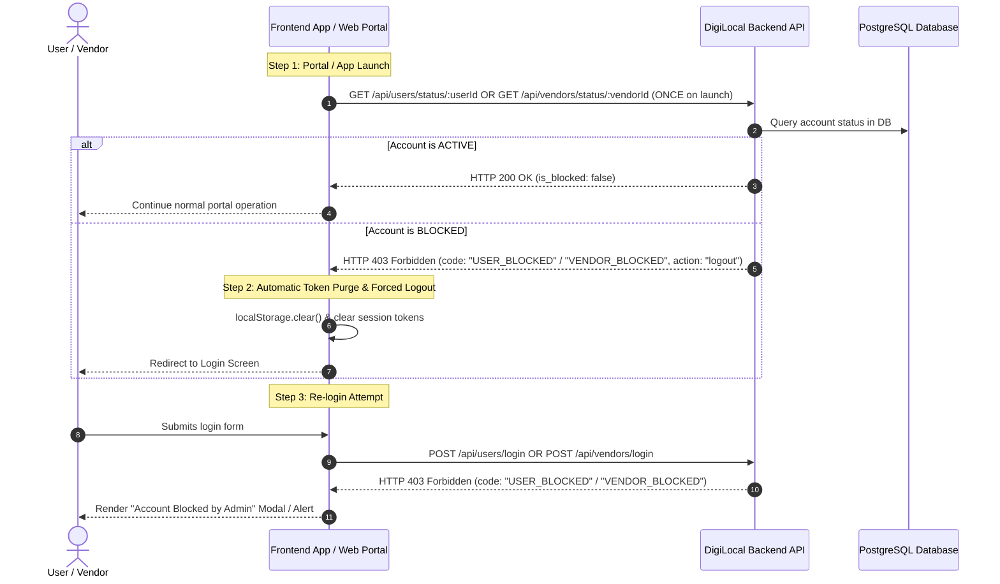

# 🛡️ DigiLocal Platform — Blocked User & Vendor Account Frontend Integration Guide

This document provides the **Complete Implementation Plan & Specification for Frontend Developers** (building the **Resident User App** and **Vendor Web/Mobile Portal**). It explains how to check if a user or vendor account is blocked by ID, execute automatic storage purging & logout, and present the blocked alert UI on login.

---

## 🚀 Architectural Plan & Execution Rules for Frontend Developers

### ⚠️ CRITICAL EXECUTION RULE: Call API ONLY ONCE per App/Portal Session
> [!IMPORTANT]
> **Performance Constraint**: 
> - **DO NOT call the status check API on every screen navigation, button click, or tab switch.**
> - **CALL THIS API ONLY ONCE** when the resident user or vendor merchant first enters their respective app/portal (e.g. on app launch, tab restoration, or root Home Screen mount).
> - This ensures immediate detection of blocked accounts while keeping app performance fast and preventing redundant network requests.

---

## 🔄 Complete 3-Step Frontend Implementation Plan



---

## 1. 📱 Resident User App Specification & API Specs

### A. Single Status Check on App Launch (`GET /api/users/status/:userId`)

- **Route**: 
  - `GET /api/users/status` *(Header: `Authorization: Bearer <USER_JWT_TOKEN>`)*
  - `GET /api/users/status/:userId`
  - `GET /api/users/:userId/status`
- **Execution**: Call **ONCE** on app launch or Home Screen `useEffect`.

#### 🔴 HTTP Response Output when Blocked (`403 Forbidden`):
```json
{
  "success": false,
  "user_id": "usr_102938",
  "status": "blocked",
  "code": "USER_BLOCKED",
  "is_blocked": true,
  "action": "logout",
  "error": "Resident user account has been blocked by administrator.",
  "message": "Your resident user account has been blocked. Please log out and contact customer support.",
  "recommended_ui_text": "Your user account has been blocked by admin. Access denied."
}
```

#### 🟢 HTTP Response Output when Active (`200 OK`):
```json
{
  "success": true,
  "user_id": "usr_102938",
  "name": "Aarushi Sharma",
  "phone": "9876543210",
  "status": "active",
  "is_blocked": false,
  "message": "User account is active."
}
```

---

### B. User App Login Endpoint (`POST /api/users/login`)

When a blocked user attempts to log in after token purge:

#### HTTP Response Output (`403 Forbidden`):
```json
{
  "success": false,
  "error": "Your resident user account has been blocked by admin.",
  "code": "USER_BLOCKED",
  "is_blocked": true,
  "block_reason": "Violation of community rules",
  "message": "Your account is blocked. Please contact customer support for assistance."
}
```

---

### C. Complete User App React / React Native Implementation Snippet

```javascript
import React, { useEffect } from 'react';

// 1. App Startup Guard (Call ONLY ONCE on Root Home Screen Mount)
export function useUserStatusGuard(userId, token) {
  useEffect(() => {
    if (!token || !userId) return;

    // Call ONLY ONCE on initial app enter
    fetch(`http://localhost:5000/api/users/status/${userId}`, {
      headers: { 'Authorization': `Bearer ${token}` }
    })
      .then(async (res) => {
        const data = await res.json();

        // Detect Blocked Account: Purge Token & Force Logout
        if (res.status === 403 || data.code === 'USER_BLOCKED' || data.action === 'logout' || data.is_blocked) {
          console.warn('⚠️ User is blocked by admin. Purging local storage and logging out...');
          
          // Step 2: Clear JWT token from local storage
          localStorage.removeItem('userToken');
          localStorage.removeItem('user');
          localStorage.clear();

          // Redirect to Login with blocked flag
          window.location.href = '/login?blocked=true';
        }
      })
      .catch(err => console.error('Status check network error:', err));
  }, [userId, token]); // Runs ONLY ONCE when component mounts
}

// 2. User Login Handler
export async function handleUserLogin(phone, passwordOrOtp) {
  try {
    const res = await fetch('http://localhost:5000/api/users/login', {
      method: 'POST',
      headers: { 'Content-Type': 'application/json' },
      body: JSON.stringify({ phone, password: passwordOrOtp })
    });

    const data = await res.json();

    // 🔴 Step 3: Handle Blocked Login Response
    if (res.status === 403 && (data.code === 'USER_BLOCKED' || data.is_blocked)) {
      alert(`🚫 Account Blocked\n\n${data.error}\nReason: ${data.block_reason || 'Policy violation'}`);
      return;
    }

    if (!res.ok) {
      alert(data.error || 'Login failed');
      return;
    }

    // 🟢 Successful Login
    localStorage.setItem('userToken', data.accessToken);
    localStorage.setItem('user', JSON.stringify(data.user));
    window.location.href = '/dashboard';
  } catch (err) {
    console.error('Login error:', err);
  }
}
```

---

## 2. 🏪 Vendor App & Web Portal Specification & API Specs

### A. Single Status Check on Vendor Portal Load (`GET /api/vendors/status/:vendorId`)

- **Route**:
  - `GET /api/vendors/status` *(Header: `Authorization: Bearer <VENDOR_JWT_TOKEN>`)*
  - `GET /api/vendors/status/:vendorId`
  - `GET /api/vendors/:vendorId/status`
- **Execution**: Call **ONCE** when vendor opens vendor portal/app dashboard.

#### 🔴 HTTP Response Output when Blocked (`403 Forbidden`):
```json
{
  "success": false,
  "vendor_id": 105,
  "status": "blocked",
  "code": "VENDOR_BLOCKED",
  "is_blocked": true,
  "is_accepted": false,
  "is_pending": false,
  "is_rejected": false,
  "is_on_hold": false,
  "action": "logout",
  "error": "Vendor account has been blocked by administrator.",
  "message": "Your vendor store account has been blocked. Please log out and contact customer support.",
  "recommended_ui_text": "Your vendor account has been blocked by admin. Access denied."
}
```

---

### B. Vendor App Login Endpoint (`POST /api/vendors/login`)

When a blocked vendor attempts to log in:

#### HTTP Response Output (`403 Forbidden`):
```json
{
  "success": false,
  "error": "Your vendor account has been blocked by admin.",
  "code": "VENDOR_BLOCKED",
  "is_blocked": true,
  "status": "blocked",
  "message": "Your vendor store account has been blocked. Please contact customer support for assistance."
}
```

---

### C. Complete Vendor Portal React / React Native Implementation Snippet

```jsx
import React, { useEffect } from 'react';

// Vendor Portal Guard Component (Calls API ONLY ONCE on dashboard load)
export function VendorPortalGuard({ vendorId, vendorToken, children }) {
  useEffect(() => {
    if (!vendorToken || !vendorId) return;

    // Call ONLY ONCE on portal entry
    fetch(`http://localhost:5000/api/vendors/status/${vendorId}`, {
      headers: { 'Authorization': `Bearer ${vendorToken}` }
    })
      .then(async (res) => {
        const data = await res.json();

        // 🔴 Handle Blocked Account: Immediate Token Purge & Logout
        if (res.status === 403 || data.code === 'VENDOR_BLOCKED' || data.action === 'logout' || data.is_blocked) {
          console.warn('⚠️ Vendor account blocked by admin. Purging storage...');

          // Clear Vendor JWT Token from Local Storage
          localStorage.removeItem('vendorToken');
          localStorage.removeItem('vendor');
          localStorage.clear();

          // Redirect to Vendor Login
          window.location.href = '/vendor/login?blocked=true';
        }
      })
      .catch(err => console.error('Vendor status check error:', err));
  }, [vendorId, vendorToken]); // Runs ONLY ONCE on mount

  return <>{children}</>;
}
```

---

## 📊 Summary Checklist for Frontend Developers

1. **Call Status API ONCE**: Call `GET /api/users/status/:userId` or `GET /api/vendors/status/:vendorId` **only once** on app/portal initialization.
2. **Detect 403 & Action Logout**: If response is `403 Forbidden` or `data.action === 'logout'`, immediately execute `localStorage.clear()`.
3. **Redirect to Login**: Route user/vendor to the login page.
4. **Display Blocked Alert**: On the login page, capture the `403 USER_BLOCKED` / `VENDOR_BLOCKED` response to display the blocked modal alert with support contact details.
