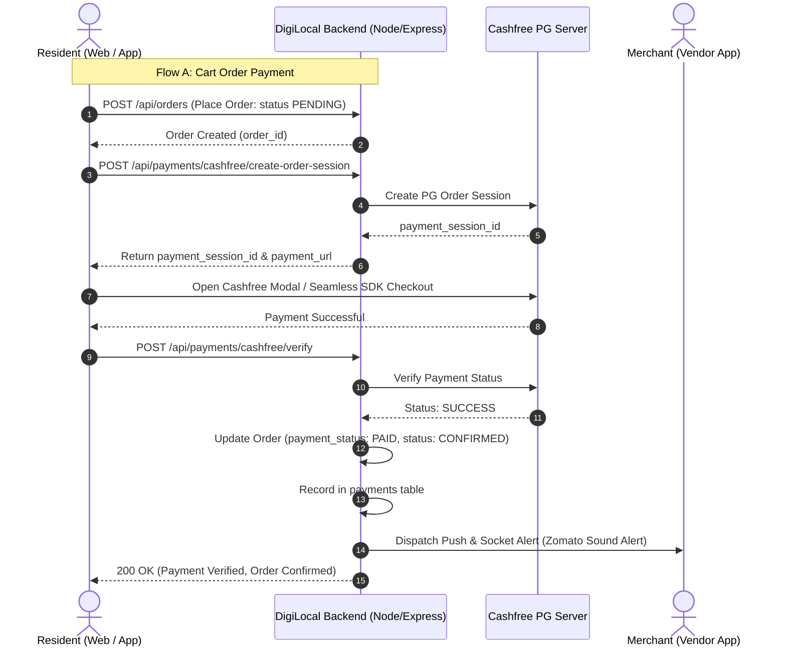

# 💳 DigiLocal Cashfree Payment Gateway Specification (User to Vendor)

> **Audience**: Website Frontend Developers, Resident Mobile App Developers (React Native/Flutter), Vendor Mobile App Developers, and Super Admin Portal Engineers.  
> **API Version**: Cashfree PG v3 (`2023-08-01`)  
> **Gateway Mode**: Seamless Dual-Mode (Live Production Gateway with Automatic Testing Simulation Fallback).

---

## 📌 Table of Contents

1. [Architecture & System Overview](#1-architecture--system-overview)
2. [Dual-Mode Operation (Live vs. Simulation)](#2-dual-mode-operation-live-vs-simulation)
3. [Resident Website & Mobile App Integration](#3-resident-website--mobile-app-integration)
   - [Flow A: Cart Order Payment](#flow-a-cart-order-payment-checkout)
   - [Flow B: Direct Scan & Pay / Bill Clearance](#flow-b-direct-scan--pay--bill-clearance)
   - [Cashfree Web SDK (React / JavaScript) Integration](#cashfree-web-sdk-javascript--react-example)
   - [React Native / Mobile App SDK Integration](#react-native--mobile-app-integration-guide)
4. [Vendor Mobile App Integration](#4-vendor-mobile-app-integration)
   - [Paid Order Badges & Sound Notifications](#order-status-indicators--push-alerts)
   - [Vendor Cashfree Payments Ledger API](#vendor-cashfree-payments-ledger-api)
5. [Admin Portal Integration](#5-admin-portal-integration)
   - [Platform-Wide Cashfree Ledger API](#platform-wide-cashfree-ledger-api)
   - [Refunds & Transaction Receipts](#refund-management)
6. [API Endpoints Reference](#6-api-endpoints-reference)
7. [Environment & Configuration Guide](#7-environment--configuration-guide)

---

## 1. Architecture & System Overview

DigiLocal enables residential customers to pay verified neighborhood merchants and society vendors seamlessly using UPI, Debit/Credit Cards, NetBanking, and Wallets via Cashfree Payment Gateway v3.



---

## 2. Dual-Mode Operation (Live vs. Simulation)

To enable frontend and mobile teams to build and test uninterrupted without waiting for live production merchant onboarding or KYC approvals, the backend automatically supports:

1. **Live Production Mode**:
   When valid `CASHFREE_APP_ID` and `CASHFREE_SECRET_KEY` are provided in `.env`, the backend connects directly to `https://api.cashfree.com/pg` (or sandbox) and returns genuine payment sessions.
2. **Graceful Simulation Mode**:
   When credentials are blank, unconfigured, or if Cashfree's IP whitelist / sandbox environment is unavailable, the backend automatically generates a simulated payment session (`session_sim_...`) and allows instant verification. Frontends can complete the exact same user journey seamlessly.

---

## 3. Resident Website & Mobile App Integration

### Flow A: Cart Order Payment Checkout

#### Step 1: Create Order
First, place or identify the order using `POST /api/orders`:
```json
{
  "vendor_id": 895,
  "user_id": "usr_9784319840",
  "items": [
    { "item_id": 101, "item_name": "Paneer Butter Masala", "quantity": 1, "price": 280 }
  ],
  "delivery_address": "Tower B, Flat 402, Greenwood Society",
  "payment_method": "CASHFREE"
}
```
*Response returns `order_id` (e.g. `ORD_1786963282104_5541`).*

#### Step 2: Request Cashfree Payment Session
Call `POST /api/payments/cashfree/create-order-session`:
* **URL**: `/api/payments/cashfree/create-order-session` (or alias `/api/payments/cashfree/create-session`)
* **Method**: `POST`
* **Request Body**:
```json
{
  "order_id": "ORD_1786963282104_5541",
  "customer_name": "Rahul Sharma",
  "customer_phone": "9876543210",
  "customer_email": "rahul@gmail.com",
  "return_url": "https://digilocal.in/payments/return?order_id={order_id}"
}
```

* **Success Response (200 OK)**:
```json
{
  "success": true,
  "payment_session_id": "session_cf_live_a89bc214d0f...",
  "order_id": "ORD_1786963282104_5541",
  "cf_order_id": "67891234",
  "order_amount": 280.00,
  "order_currency": "INR",
  "payment_status": "ACTIVE",
  "payment_url": "https://payments.cashfree.com/order/#ORD_1786963282104_5541",
  "mode": "live",
  "vendor_id": 895,
  "store_name": "Gupta Sweets & Bakers"
}
```

#### Step 3: Trigger Cashfree Checkout in Client
Pass `payment_session_id` to Cashfree Web SDK or Mobile SDK (see code snippets below).

#### Step 4: Verify Payment & Confirm Order
Once Cashfree triggers the completion callback or redirect:
* **URL**: `/api/payments/cashfree/verify` (or alias `/api/payments/cashfree/verify-order`)
* **Method**: `POST`
* **Request Body**:
```json
{
  "order_id": "ORD_1786963282104_5541",
  "cashfree_order_id": "ORD_1786963282104_5541",
  "cashfree_payment_id": "cf_pay_192837465"
}
```

* **Success Response (200 OK)**:
```json
{
  "success": true,
  "verified": true,
  "message": "Payment verified successfully. Order confirmed.",
  "order_id": "ORD_1786963282104_5541",
  "payment_status": "PAID",
  "payment_method": "CASHFREE",
  "cashfree_order_id": "ORD_1786963282104_5541",
  "cashfree_payment_id": "cf_pay_192837465",
  "paid_at": "2026-09-09T14:20:00.000Z",
  "order": {
    "order_id": "ORD_1786963282104_5541",
    "vendor_id": 895,
    "total_amount": 280.00,
    "status": "CONFIRMED",
    "payment_status": "PAID",
    "payment_method": "CASHFREE"
  }
}
```

---

### Flow B: Direct Scan & Pay / Bill Clearance

Residents can pay any vendor directly (e.g. offline store purchases, society grocery bills, monthly Khatta clearance) without pre-creating a cart order.

* **URL**: `/api/payments/cashfree/pay-vendor-direct`
* **Method**: `POST`
* **Request Body**:
```json
{
  "vendor_id": 895,
  "amount": 450.00,
  "customer_name": "Ananya Roy",
  "customer_phone": "9811223344",
  "customer_email": "ananya@gmail.com",
  "notes": "Payment for August Groceries & Dairy",
  "return_url": "https://digilocal.in/payments/direct-return?order_id={order_id}"
}
```

* **Success Response (200 OK)**:
```json
{
  "success": true,
  "payment_session_id": "session_cf_dir_b82a1701...",
  "order_id": "CF_DIR_1786963351000_4821",
  "cf_order_id": "67899011",
  "order_amount": 450.00,
  "order_currency": "INR",
  "payment_url": "https://payments.cashfree.com/order/#CF_DIR_1786963351000_4821",
  "mode": "live",
  "vendor": {
    "vendor_id": 895,
    "store_name": "Gupta Sweets & Bakers",
    "vendor_name": "Amit Gupta",
    "upi_id": "guptasweets@okhdfcbank"
  }
}
```

* **Verification for Direct Payment**:
* **URL**: `/api/payments/cashfree/verify-direct`
* **Method**: `POST`
* **Request Body**:
```json
{
  "order_id": "CF_DIR_1786963351000_4821",
  "vendor_id": 895,
  "cashfree_payment_id": "cf_pay_998877",
  "amount": 450.00,
  "customer_name": "Ananya Roy",
  "customer_phone": "9811223344",
  "notes": "Payment for August Groceries & Dairy"
}
```

---

### Cashfree Web SDK (JavaScript / React Example)

Include the Cashfree JS SDK in your `index.html` or load dynamically:
```html
<script src="https://sdk.cashfree.com/js/v3/cashfree.js"></script>
```

#### React Component Implementation:
```javascript
import React, { useState } from 'react';

export function CheckoutPaymentButton({ orderId, amount, customerName, customerPhone }) {
  const [loading, setLoading] = useState(false);

  const handleOnlinePayment = async () => {
    try {
      setLoading(true);

      // 1. Request Cashfree payment session from DigiLocal backend
      const res = await fetch('/api/payments/cashfree/create-order-session', {
        method: 'POST',
        headers: { 'Content-Type': 'application/json' },
        body: JSON.stringify({
          order_id: orderId,
          amount: amount,
          customer_name: customerName,
          customer_phone: customerPhone
        })
      });
      const data = await res.json();

      if (!data.success || !data.payment_session_id) {
        alert(data.error || 'Failed to initialize payment session');
        return;
      }

      // 2. Initialize Cashfree Web SDK v3
      const cashfree = window.Cashfree({
        mode: data.mode === 'live' ? 'production' : 'sandbox'
      });

      // 3. Trigger Modal / Drop-in Checkout
      const checkoutOptions = {
        paymentSessionId: data.payment_session_id,
        redirectTarget: '_modal' // or '_self' for full page redirect
      };

      cashfree.checkout(checkoutOptions).then(async (result) => {
        if (result.error) {
          console.warn('Payment closed or error:', result.error);
          return;
        }

        // 4. Verify payment on DigiLocal backend
        const verifyRes = await fetch('/api/payments/cashfree/verify', {
          method: 'POST',
          headers: { 'Content-Type': 'application/json' },
          body: JSON.stringify({
            order_id: orderId,
            cashfree_order_id: data.order_id
          })
        });
        const verifyData = await verifyRes.json();

        if (verifyData.success && verifyData.verified) {
          alert('🎉 Payment confirmed! Your order has been placed.');
          window.location.href = `/orders/${orderId}/success`;
        } else {
          alert('⚠️ Payment status: ' + (verifyData.payment_status || 'Pending'));
        }
      });
    } catch (err) {
      console.error('Payment checkout error:', err);
      alert('Payment initialization failed.');
    } finally {
      setLoading(false);
    }
  };

  return (
    <button 
      onClick={handleOnlinePayment} 
      disabled={loading}
      className="btn-pay-cashfree"
    >
      {loading ? 'Securing Payment Session...' : `Pay ₹${amount} with Cashfree`}
    </button>
  );
}
```

---

### React Native / Mobile App Integration Guide

In React Native or Expo applications, you can use `@cashfreepayments/cashfree-pg-api-contract` or open `payment_url` in a secure `react-native-webview`:

```javascript
import React from 'react';
import { WebView } from 'react-native-webview';

export function CashfreePaymentScreen({ route, navigation }) {
  const { paymentUrl, orderId } = route.params;

  const handleNavigationStateChange = async (navState) => {
    // Detect return URL callback
    if (navState.url.includes('/payments/cashfree/return') || navState.url.includes('/payments/return')) {
      // Trigger backend verification
      await fetch('https://api.digilocal.in/api/payments/cashfree/verify', {
        method: 'POST',
        headers: { 'Content-Type': 'application/json' },
        body: JSON.stringify({ order_id: orderId })
      });

      navigation.replace('OrderSuccessScreen', { orderId });
    }
  };

  return (
    <WebView
      source={{ uri: paymentUrl }}
      onNavigationStateChange={handleNavigationStateChange}
      startInLoadingState={true}
    />
  );
}
```

---

## 4. Vendor Mobile App Integration

### Order Status Indicators & Push Alerts

When a customer pays via Cashfree:
1. `orders.payment_status` is automatically set to `'PAID'`.
2. `orders.payment_method` is set to `'CASHFREE'`.
3. `orders.status` is set to `'CONFIRMED'`.
4. The backend dispatches an instant, high-priority notification via Firebase Cloud Messaging (FCM) & Expo Push Notification API to the vendor's device with sound alert:
   - **Title**: `NEW ORDER #ORD_1786963282104_5541!`
   - **Body**: `Customer: Rahul Sharma • Total: ₹280.00 • PAID (Cashfree)`
   - **Data Payload**: `{ order_id: "...", payment_status: "PAID", payment_method: "CASHFREE" }`

### Vendor Cashfree Payments Ledger API

Vendors can view their complete online collections and balance:
* **URL**: `GET /api/vendors/:vendorId/cashfree-payments`
* **Query Parameters**:
  - `status`: `SUCCESS` | `PENDING` | `ALL` (default: `ALL`)
  - `limit`: number (default: `50`)
  - `offset`: number (default: `0`)

#### Response (200 OK):
```json
{
  "success": true,
  "vendor": {
    "vendor_id": 895,
    "store_name": "Gupta Sweets & Bakers",
    "vendor_name": "Amit Gupta"
  },
  "summary": {
    "total_transactions": 24,
    "total_amount_received": 14850.00,
    "total_amount_pending": 0.00,
    "currency": "INR"
  },
  "payments": [
    {
      "payment_id": 142,
      "order_id": "ORD_1786963282104_5541",
      "vendor_id": 895,
      "amount": 280.00,
      "currency": "INR",
      "payment_status": "SUCCESS",
      "payment_method": "CASHFREE",
      "cashfree_payment_id": "cf_pay_192837465",
      "customer_name": "Rahul Sharma",
      "customer_phone": "9876543210",
      "created_at": "2026-09-09T14:20:00.000Z"
    }
  ]
}
```

---

## 5. Admin Portal Integration

### Platform-Wide Cashfree Ledger API

Super Admins can audit all platform payment flows across all societies and merchants:
* **URL**: `GET /api/admin/payments/cashfree-ledger`
* **Query Parameters**:
  - `status`: `SUCCESS` | `PENDING` | `ALL`
  - `vendor_id`: filter by specific vendor ID
  - `search`: search by customer name, order ID, or payment ID
  - `limit`: number (default: `100`)
  - `offset`: number (default: `0`)

#### Response (200 OK):
```json
{
  "success": true,
  "summary": {
    "total_volume": 482590.00,
    "total_transactions": 850,
    "successful_transactions": 842,
    "pending_transactions": 8,
    "currency": "INR"
  },
  "count": 100,
  "limit": 100,
  "offset": 0,
  "payments": [
    {
      "payment_id": 512,
      "order_id": "ORD_1786963282104_5541",
      "vendor_id": 895,
      "store_name": "Gupta Sweets & Bakers",
      "vendor_name": "Amit Gupta",
      "amount": 280.00,
      "payment_status": "SUCCESS",
      "payment_method": "CASHFREE",
      "cashfree_payment_id": "cf_pay_192837465",
      "customer_name": "Rahul Sharma",
      "customer_phone": "9876543210",
      "created_at": "2026-09-09T14:20:00.000Z"
    }
  ]
}
```

### Refund Management
Admins can process full or partial customer refunds via:
* **URL**: `POST /api/payments/refund`
* **Body**:
```json
{
  "payment_id": 512,
  "order_id": "ORD_1786963282104_5541",
  "refund_amount": 280.00,
  "refund_reason": "Item out of stock / Customer requested cancellation"
}
```

---

## 6. API Endpoints Reference

| Endpoint | Method | Purpose | Consumer |
| :--- | :--- | :--- | :--- |
| `/api/payments/cashfree/create-order-session` | `POST` | Generate checkout session for a cart order | Website & User App |
| `/api/payments/cashfree/verify` | `POST` | Verify order payment & confirm order | Website & User App |
| `/api/payments/cashfree/pay-vendor-direct` | `POST` | Create session for direct scan & pay / bill payment | Website & User App |
| `/api/payments/cashfree/verify-direct` | `POST` | Verify and record direct vendor payment | Website & User App |
| `/api/payments/cashfree/webhook` | `POST` | Cashfree asynchronous PG webhook listener | Cashfree Server |
| `/api/vendors/:vendorId/cashfree-payments` | `GET` | Retrieve vendor online payment ledger & stats | Vendor Mobile App |
| `/api/admin/payments/cashfree-ledger` | `GET` | Global platform-wide payments ledger | Super Admin Portal |

---

## 7. Environment & Configuration Guide

Credentials can be maintained or updated in `.env`:

```env
# Cashfree Production / Sandbox Credentials
CASHFREE_APP_ID=1369289019fa421dddf71e590759829631
CASHFREE_SECRET_KEY=cfsk_ma_prod_xxxxxxxxxxxxxxxxxxxxxxxxxx
CASHFREE_ENV=PRODUCTION
CASHFREE_API_VERSION=2023-08-01

# Public Base URL for callbacks & notifications
PUBLIC_API_URL=https://digilocal.in
```

> [!TIP]
> If `CASHFREE_APP_ID` or `CASHFREE_SECRET_KEY` are not provided, the backend seamlessly activates **Simulation Mode**, generating functional mock sessions so that UI/UX flows and mobile testing are never blocked.
