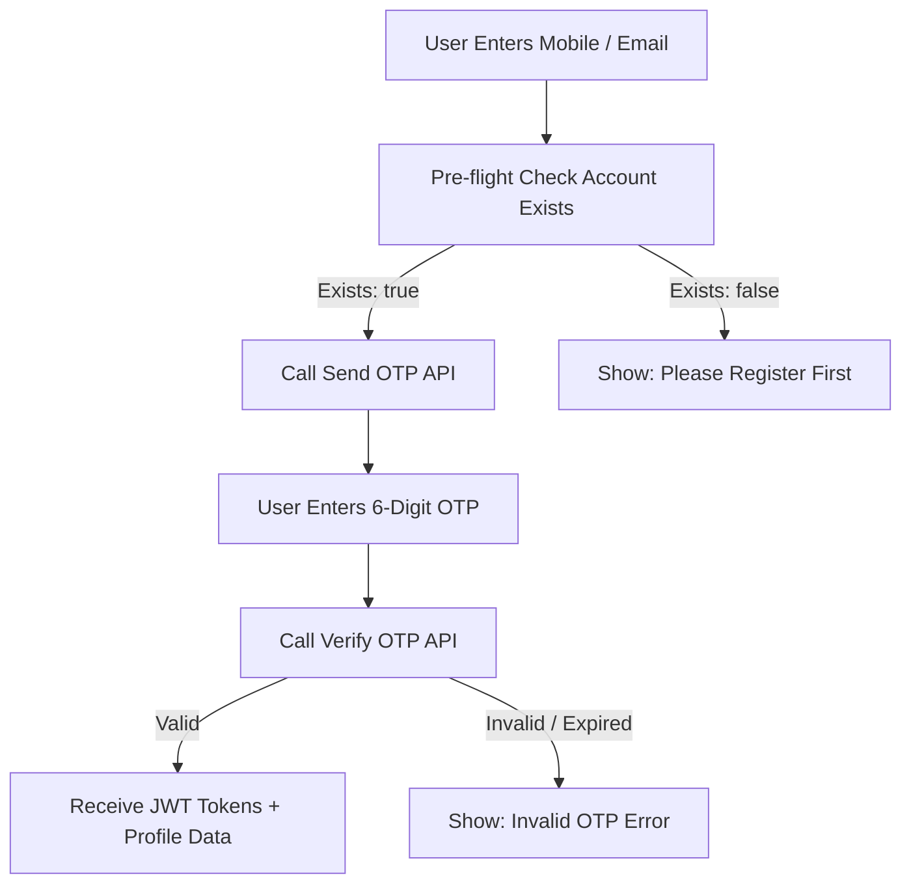

# 🔐 DigiLocal — Complete Mobile & Email OTP API Documentation
> **Target Audience:** Vendor Mobile App Developer & Resident User Web Developer  
> **Base URL (Deployed):** `https://digi-local-backend.onrender.com`  
> **Base URL (Local):** `http://localhost:5000`  
> **Version:** 2.0.0

---

## 📌 Overview

The DigiLocal authentication system supports passwordless OTP login and OTP registration across two channels:
1. **Mobile SMS OTP:** Powered by Message Central CPaaS (6-digit numeric OTP)
2. **Email OTP:** Powered by AWS SES SMTP (6-digit numeric OTP with responsive HTML template, 10-minute TTL)

---

## 🧭 Flow Summary



---

## 🛡️ Part 1: Pre-flight Account Guard APIs

Before calling Send OTP, frontend apps can perform an instant check to verify if the account is registered.

### 1.1 Check Vendor Account (Phone or Email)
Check if a vendor store profile exists in the database.

- **Endpoint:** `POST /api/vendors/check-phone` or `POST /api/vendors/check-email`
- **Headers:** `Content-Type: application/json`

**Request Body (Phone):**
```json
{
  "phone": "9509512187"
}
```

**Request Body (Email):**
```json
{
  "email": "john@gmail.com"
}
```

**Response `200 OK` (Registered Vendor):**
```json
{
  "exists": true,
  "is_registered": true,
  "vendor_id": 1337,
  "public_id": "vnd@1337",
  "store_name": "John",
  "vendor_name": "John",
  "phone_number": "9509512187",
  "email": "john@gmail.com",
  "status": "active",
  "message": "Vendor store account found."
}
```

**Response `200 OK` (Unregistered):**
```json
{
  "exists": false,
  "is_registered": false,
  "message": "No vendor store account found with this credential."
}
```

---

### 1.2 Check Resident User Account
Check if a resident user account exists in the database.

- **Endpoint:** `POST /api/users/check-phone`
- **Headers:** `Content-Type: application/json`

**Request Body:**
```json
{
  "phone": "9571240742"
}
```

**Response `200 OK` (Registered):**
```json
{
  "exists": true,
  "user_id": "usr_v_1386",
  "name": "Lovely Sethiya",
  "phone": "9571240742"
}
```

---

## 📱 Part 2: Mobile SMS OTP APIs

### 2.1 Send Mobile SMS OTP
Dispatches an SMS verification code to the registered mobile number.

- **Endpoint:** `POST /api/otp/mobile/send-otp`
- **Aliases:** `POST /api/otp/send-otp`, `POST /api/vendors/send-otp`
- **Headers:** `Content-Type: application/json`

**Request Body:**
```json
{
  "phone": "9509512187",
  "role": "vendor",
  "purpose": "login"
}
```

| Field | Type | Required | Description |
|---|---|---|---|
| `phone` | string | **Yes** | 10-digit mobile number (e.g., `"9509512187"`) |
| `role` | string | Optional | `"vendor"` for Vendor App, `"user"` for Resident Web |
| `purpose` | string | Optional | `"login"` (default) or `"register"` |
| `country_code` | string | Optional | Country dialing code without `+` (default: `"91"`) |

**Success Response `200 OK`:**
```json
{
  "success": true,
  "channel": "mobile_sms",
  "provider": "message_central",
  "message": "Mobile OTP sent successfully via SMS",
  "phone": "9509512187",
  "verification_id": "1790400012345",
  "verificationId": "1790400012345"
}
```

**Error Response `404 Not Found` (Unregistered Phone):**
```json
{
  "success": false,
  "exists": false,
  "error": "No vendor store account found with this mobile number. Please register your account first.",
  "message": "No vendor store account found with this mobile number. Please register your account first."
}
```

---

### 2.2 Verify Mobile SMS OTP & Login
Verifies the submitted 6-digit SMS code and returns JWT authentication tokens + profile.

- **Endpoint:** `POST /api/otp/mobile/verify-otp`
- **Aliases:** `POST /api/otp/verify-otp`, `POST /api/vendors/otp-login`
- **Headers:** `Content-Type: application/json`

**Request Body:**
```json
{
  "phone": "9509512187",
  "otp": "123456",
  "role": "vendor",
  "verification_id": "1790400012345"
}
```

| Field | Type | Required | Description |
|---|---|---|---|
| `phone` | string | **Yes** | 10-digit mobile number |
| `otp` | string | **Yes** | 6-digit numeric OTP code |
| `role` | string | Optional | `"vendor"` or `"user"` |
| `verification_id`| string | Optional | Verification ID received from Send OTP |

**Success Response `200 OK` (Vendor Portal):**
```json
{
  "success": true,
  "verified": true,
  "channel": "mobile_sms",
  "provider": "message_central",
  "message": "Mobile OTP verified successfully. Login successful.",
  "role": "vendor",
  "token": "eyJhbGciOiJIUzI1NiIsInR5cCI6IkpXVCJ9...",
  "accessToken": "eyJhbGciOiJIUzI1NiIsInR5cCI6IkpXVCJ9...",
  "refreshToken": "eyJhbGciOiJIUzI1NiIsInR5cCI6IkpXVCJ9...",
  "vendor_id": 1337,
  "public_id": "vnd@1337",
  "vendor": {
    "vendor_id": 1337,
    "public_id": "vnd@1337",
    "store_name": "John",
    "vendor_name": "John",
    "email": "john@gmail.com",
    "phone_number": "9509512187",
    "status": "active",
    "role": "vendor"
  }
}
```

**Success Response `200 OK` (User Portal):**
```json
{
  "success": true,
  "verified": true,
  "channel": "mobile_sms",
  "role": "user",
  "token": "eyJhbGciOiJIUzI1NiIsInR5cCI6IkpXVCJ9...",
  "accessToken": "eyJhbGciOiJIUzI1NiIsInR5cCI6IkpXVCJ9...",
  "refreshToken": "eyJhbGciOiJIUzI1NiIsInR5cCI6IkpXVCJ9...",
  "user": {
    "user_id": "usr_v_1386",
    "name": "Lovely Sethiya",
    "email": "lovelysethia753@gmail.com",
    "phone": "9571240742",
    "role": "user"
  }
}
```

**Error Response `400 Bad Request` (Invalid / Expired OTP):**
```json
{
  "success": false,
  "verified": false,
  "error": "Invalid or expired mobile OTP code",
  "message": "Invalid or expired mobile OTP code"
}
```

**Error Response `404 Not Found` (Unregistered Account):**
```json
{
  "success": false,
  "verified": false,
  "exists": false,
  "error": "No vendor store account found with this mobile number. Please register your account first.",
  "message": "No vendor store account found with this mobile number. Please register your account first."
}
```

---

## 📧 Part 3: Email OTP APIs

### 3.1 Send Email OTP
Sends a 6-digit verification code to the registered email address via AWS SES.

- **Endpoint:** `POST /api/otp/email/send-otp`
- **Aliases:** `POST /api/otp/send-otp`, `POST /api/email/send-otp`
- **Headers:** `Content-Type: application/json`

**Request Body:**
```json
{
  "email": "john@gmail.com",
  "role": "vendor",
  "purpose": "login"
}
```

| Field | Type | Required | Description |
|---|---|---|---|
| `email` | string | **Yes** | Valid registered email address |
| `role` | string | Optional | `"vendor"` for Vendor App, `"user"` for Resident Web |
| `purpose` | string | Optional | `"login"` (default) or `"register"` |

**Success Response `200 OK`:**
```json
{
  "success": true,
  "channel": "email",
  "provider": "aws_ses",
  "message": "OTP verification code sent to john@gmail.com",
  "email": "john@gmail.com",
  "expires_in_seconds": 600,
  "ttl_minutes": 10
}
```

**Error Response `404 Not Found` (Unregistered Email):**
```json
{
  "success": false,
  "exists": false,
  "error": "No vendor store account found with this email address. Please register your account first.",
  "message": "No vendor store account found with this email address. Please register your account first."
}
```

---

### 3.2 Verify Email OTP & Login
Verifies the submitted 6-digit email OTP and returns JWT authentication tokens + profile.

- **Endpoint:** `POST /api/otp/email/verify-otp`
- **Aliases:** `POST /api/otp/verify-otp`, `POST /api/email/verify-otp`
- **Headers:** `Content-Type: application/json`

**Request Body:**
```json
{
  "email": "john@gmail.com",
  "otp": "123456",
  "role": "vendor"
}
```

**Success Response `200 OK` (Vendor Login):**
```json
{
  "success": true,
  "verified": true,
  "channel": "email",
  "message": "Email OTP verified successfully. Login successful.",
  "email": "john@gmail.com",
  "role": "vendor",
  "token": "eyJhbGciOiJIUzI1NiIsInR5cCI6IkpXVCJ9...",
  "accessToken": "eyJhbGciOiJIUzI1NiIsInR5cCI6IkpXVCJ9...",
  "refreshToken": "eyJhbGciOiJIUzI1NiIsInR5cCI6IkpXVCJ9...",
  "vendor_id": 1337,
  "public_id": "vnd@1337",
  "vendor": {
    "vendor_id": 1337,
    "public_id": "vnd@1337",
    "store_name": "John",
    "vendor_name": "John",
    "email": "john@gmail.com",
    "phone_number": "9509512187",
    "status": "active",
    "role": "vendor"
  }
}
```

**Error Response `400 Bad Request` (Wrong or Expired Code):**
```json
{
  "success": false,
  "verified": false,
  "error": "Invalid or expired OTP code",
  "message": "Invalid or expired OTP code"
}
```

---

## 📝 Part 4: Registration OTP Flow (New Sign-ups)

When a brand-new user or vendor wants to register:

1. **Request Registration OTP:**
   Pass `"purpose": "register"`:
   ```json
   POST /api/otp/email/send-otp
   {
     "email": "newvendor@example.com",
     "purpose": "register"
   }
   ```
   - If account already exists -> `400 Bad Request` ("Account already exists. Please log in instead.")
   - If new account -> `200 OK` (OTP sent)

2. **Verify Registration OTP:**
   ```json
   POST /api/otp/email/verify-otp
   {
     "email": "newvendor@example.com",
     "otp": "123456",
     "purpose": "register"
   }
   ```
   - Returns `{ "success": true, "verified": true }` to proceed with registration form submit.

---

## ⚡ JavaScript / React Native / Axios Integration Examples

### Example 1: Full Vendor OTP Login with Pre-flight Guard (React Native / Web)

```javascript
import axios from 'axios';

const BASE_URL = 'https://digi-local-backend.onrender.com';

/**
 * Step 1: Pre-flight check & Send OTP
 */
async function sendLoginOtp(identifier) {
  const isEmail = identifier.includes('@');
  
  // 1. Pre-flight check
  const checkRes = await axios.post(`${BASE_URL}/api/vendors/check-phone`, {
    [isEmail ? 'email' : 'phone']: identifier
  });
  
  if (!checkRes.data.exists) {
    throw new Error('No vendor store account found. Please register first.');
  }

  // 2. Send OTP
  const endpoint = isEmail 
    ? `${BASE_URL}/api/otp/email/send-otp` 
    : `${BASE_URL}/api/otp/mobile/send-otp`;
    
  const sendRes = await axios.post(endpoint, {
    [isEmail ? 'email' : 'phone']: identifier,
    role: 'vendor',
    purpose: 'login'
  });
  
  return sendRes.data; // contains verification_id for mobile SMS
}

/**
 * Step 2: Verify OTP & Complete Login
 */
async function verifyLoginOtp(identifier, otpCode, verificationId = null) {
  const isEmail = identifier.includes('@');
  
  const endpoint = isEmail 
    ? `${BASE_URL}/api/otp/email/verify-otp` 
    : `${BASE_URL}/api/otp/mobile/verify-otp`;
    
  const payload = {
    [isEmail ? 'email' : 'phone']: identifier,
    otp: otpCode,
    role: 'vendor',
    ...(verificationId && { verification_id: verificationId })
  };

  const verifyRes = await axios.post(endpoint, payload);
  
  // Save tokens to AsyncStorage / LocalStorage
  const { accessToken, refreshToken, vendor } = verifyRes.data;
  localStorage.setItem('accessToken', accessToken);
  localStorage.setItem('vendorProfile', JSON.stringify(vendor));

  return verifyRes.data;
}
```

---

## 🛑 HTTP Status Code Reference

| Status Code | Meaning | When It Occurs |
|---|---|---|
| **`200 OK`** | Success | OTP sent successfully, or OTP verified and tokens issued |
| **`400 Bad Request`** | Validation / Verification Error | Invalid OTP, missing fields, or duplicate email/phone during registration |
| **`403 Forbidden`** | Account Blocked | Vendor/User account has been blocked or suspended by admin |
| **`404 Not Found`** | Unregistered Account | Phone/Email does not exist in the database during login |
| **`502 Bad Gateway`** | Third-party Gateway Error | SMS CPaaS or AWS SES delivery failed |
| **`500 Internal Server Error`** | Server Error | Unhandled backend exception |
