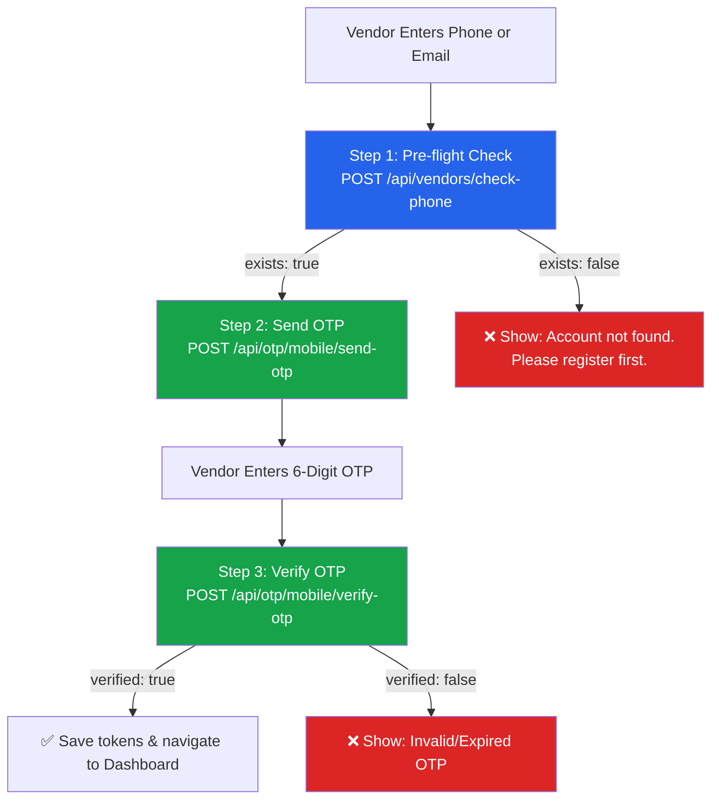

# 🔐 DigiLocal — Vendor App OTP API Documentation

> **For:** Vendor Mobile App Frontend Developer (React Native / Expo)  
> **Base URL:** `https://digi-local-backend.onrender.com`  
> **Version:** 3.0.0  
> **Last Updated:** 28 Sep 2026

---

## ⚠️ CRITICAL: Mandatory Rules

> **Every OTP request from the Vendor App MUST include `"role": "vendor"` in the JSON body.**  
> Without this, the backend will reject the request with `400 Bad Request`.

> **Only `phone` is needed** — do NOT send redundant `mobile`, `phone_number` fields.  
> Keep the payload clean and minimal.

---

## 🧭 Complete Login Flow



---

## 📋 Step 1: Pre-flight Account Check (RECOMMENDED)

Check if a vendor store account exists **before** sending OTP.  
This is instant, costs nothing, and gives immediate feedback.

### Endpoint

```
POST /api/vendors/check-phone
```

### Headers

```
Content-Type: application/json
```

### Request Body (Check by Phone)

```json
{
  "phone": "9509512187"
}
```

### Request Body (Check by Email)

```json
{
  "email": "john@gmail.com"
}
```

### ✅ Response — Vendor Found (`200 OK`)

```json
{
  "exists": true,
  "is_registered": true,
  "vendor_id": 1337,
  "public_id": "vnd@1337",
  "store_name": "John",
  "vendor_name": "John",
  "phone_number": "9509512187",
  "email": "john@gmail.com",
  "status": "active",
  "message": "Vendor store account found."
}
```

### ❌ Response — Vendor NOT Found (`200 OK`)

```json
{
  "exists": false,
  "is_registered": false,
  "message": "No vendor store account found with this credential."
}
```

> **Frontend Logic:** If `exists === false`, show error and **do NOT proceed** to Send OTP.

---

## 📱 Step 2: Send Mobile SMS OTP

Dispatches a 6-digit SMS OTP to the vendor's registered mobile number.

### Endpoint

```
POST /api/otp/mobile/send-otp
```

### Headers

```
Content-Type: application/json
```

### ✅ Correct Request Body

```json
{
  "phone": "9509512187",
  "country_code": "91",
  "role": "vendor",
  "purpose": "login"
}
```

### ❌ WRONG — What your app currently sends (DO NOT DO THIS)

```json
{
  "phone": "9509512187",
  "mobile": "9509512187",
  "phone_number": "9509512187",
  "country_code": "91",
  "purpose": "login"
}
```

**Problems:** Missing `role: "vendor"`, sending redundant `mobile` and `phone_number` fields.

### Field Reference

| Field | Type | Required | Description |
|---|---|---|---|
| `phone` | string | **YES** | 10-digit mobile number (e.g., `"9509512187"`) |
| `role` | string | **YES** | Must be `"vendor"` for Vendor App |
| `purpose` | string | **YES** | `"login"` for login, `"register"` for new sign-ups |
| `country_code` | string | Optional | Country dialing code without `+` (default: `"91"`) |

### ✅ Success Response (`200 OK`)

```json
{
  "success": true,
  "channel": "mobile_sms",
  "provider": "message_central",
  "message": "Mobile OTP sent successfully via SMS",
  "phone": "9509512187",
  "verification_id": "1790400012345",
  "verificationId": "1790400012345"
}
```

> **Important:** Save the `verification_id` — you need it in Step 3.

### ❌ Error Response — Vendor NOT Registered (`404 Not Found`)

```json
{
  "success": false,
  "exists": false,
  "error": "No vendor store account found with this mobile number. Please register your account first.",
  "message": "No vendor store account found with this mobile number. Please register your account first."
}
```

### ❌ Error Response — Missing Role (`400 Bad Request`)

```json
{
  "success": false,
  "error": "\"role\" is required for login. Pass role: \"vendor\" or role: \"user\".",
  "message": "\"role\" is required for login. Pass role: \"vendor\" or role: \"user\"."
}
```

---

## ✅ Step 3: Verify Mobile OTP & Login

Verifies the 6-digit SMS code and returns JWT tokens + vendor profile.

### Endpoint

```
POST /api/otp/mobile/verify-otp
```

### Headers

```
Content-Type: application/json
```

### Request Body

```json
{
  "phone": "9509512187",
  "otp": "123456",
  "role": "vendor",
  "verification_id": "1790400012345"
}
```

### Field Reference

| Field | Type | Required | Description |
|---|---|---|---|
| `phone` | string | **YES** | Same phone number used in Send OTP |
| `otp` | string | **YES** | 6-digit numeric OTP code entered by vendor |
| `role` | string | **YES** | Must be `"vendor"` |
| `verification_id` | string | Recommended | The `verification_id` from Send OTP response |

### ✅ Success Response (`200 OK`)

```json
{
  "success": true,
  "verified": true,
  "channel": "mobile_sms",
  "provider": "message_central",
  "message": "Mobile OTP verified successfully. Login successful.",
  "phone": "9509512187",
  "role": "vendor",
  "token": "eyJhbGciOiJIUzI1NiIsInR5cCI6IkpXVCJ9...",
  "accessToken": "eyJhbGciOiJIUzI1NiIsInR5cCI6IkpXVCJ9...",
  "refreshToken": "eyJhbGciOiJIUzI1NiIsInR5cCI6IkpXVCJ9...",
  "vendor_id": 1337,
  "public_id": "vnd@1337",
  "vendor": {
    "vendor_id": 1337,
    "public_id": "vnd@1337",
    "store_name": "John",
    "vendor_name": "John",
    "email": "john@gmail.com",
    "phone_number": "9509512187",
    "status": "active",
    "role": "vendor"
  }
}
```

> **Frontend Logic:**
> - Save `accessToken` and `refreshToken` to AsyncStorage
> - Save `vendor` object as the active profile
> - Navigate to Dashboard

### ❌ Error — Invalid or Expired OTP (`400 Bad Request`)

```json
{
  "success": false,
  "verified": false,
  "error": "Invalid or expired mobile OTP code",
  "message": "Invalid or expired mobile OTP code"
}
```

### ❌ Error — Vendor Not Found (`404 Not Found`)

```json
{
  "success": false,
  "verified": false,
  "exists": false,
  "error": "No vendor store account found with this mobile number. Please register your account first.",
  "message": "No vendor store account found with this mobile number. Please register your account first."
}
```

### ❌ Error — Account Blocked (`403 Forbidden`)

```json
{
  "success": false,
  "error": "Your vendor account has been blocked by admin.",
  "message": "Your vendor store account has been blocked. Please contact customer support."
}
```

---

## 📧 Email OTP APIs (Same Flow, Different Channel)

If the vendor logs in via email instead of phone:

### Send Email OTP

```
POST /api/otp/email/send-otp
```

```json
{
  "email": "john@gmail.com",
  "role": "vendor",
  "purpose": "login"
}
```

**Success (`200 OK`):**
```json
{
  "success": true,
  "channel": "email",
  "provider": "aws_ses",
  "message": "OTP verification code sent to john@gmail.com",
  "email": "john@gmail.com",
  "expires_in_seconds": 600,
  "ttl_minutes": 10
}
```

### Verify Email OTP & Login

```
POST /api/otp/email/verify-otp
```

```json
{
  "email": "john@gmail.com",
  "otp": "123456",
  "role": "vendor"
}
```

**Success response** is identical to Mobile OTP verify (contains `accessToken`, `refreshToken`, `vendor` object).

---

## 📝 Registration OTP Flow (New Vendor Sign-up)

When a new vendor wants to register, use `"purpose": "register"`:

### 1. Send Registration OTP

```json
POST /api/otp/mobile/send-otp
{
  "phone": "9876543210",
  "country_code": "91",
  "role": "vendor",
  "purpose": "register"
}
```

- If phone already exists → `400 Bad Request` ("Account already exists. Please log in instead.")
- If new phone → `200 OK` (OTP sent)

### 2. Verify Registration OTP

```json
POST /api/otp/mobile/verify-otp
{
  "phone": "9876543210",
  "otp": "123456",
  "role": "vendor",
  "purpose": "register",
  "verification_id": "1790400012345"
}
```

- Returns `{ "success": true, "verified": true }` — proceed to registration form submission.

> **Note:** Registration OTP verify does NOT return tokens — the vendor account must be created first via `POST /api/vendors/register`.

---

## ⚡ React Native / Axios Code Example

```javascript
import axios from 'axios';
import AsyncStorage from '@react-native-async-storage/async-storage';

const API = axios.create({
  baseURL: 'https://digi-local-backend.onrender.com',
  headers: { 'Content-Type': 'application/json' }
});

// ── Step 1: Pre-flight Check ────────────────────────────────
async function checkVendorExists(phone) {
  const { data } = await API.post('/api/vendors/check-phone', { phone });
  return data.exists; // true or false
}

// ── Step 2: Send OTP ────────────────────────────────────────
async function sendOtp(phone) {
  // Optional: pre-flight check for instant feedback
  const exists = await checkVendorExists(phone);
  if (!exists) {
    throw new Error('No vendor account found. Please register first.');
  }

  const { data } = await API.post('/api/otp/mobile/send-otp', {
    phone,
    role: 'vendor',        // ← MANDATORY
    purpose: 'login',      // ← MANDATORY
    country_code: '91'
  });

  return data.verification_id; // Save this for Step 3
}

// ── Step 3: Verify OTP & Login ──────────────────────────────
async function verifyOtpAndLogin(phone, otpCode, verificationId) {
  const { data } = await API.post('/api/otp/mobile/verify-otp', {
    phone,
    otp: otpCode,
    role: 'vendor',        // ← MANDATORY
    verification_id: verificationId
  });

  if (data.success && data.verified) {
    // Save tokens
    await AsyncStorage.setItem('accessToken', data.accessToken);
    await AsyncStorage.setItem('refreshToken', data.refreshToken);
    await AsyncStorage.setItem('vendor', JSON.stringify(data.vendor));
    return data;
  }

  throw new Error(data.message || 'OTP verification failed');
}
```

---

## 🔑 Using JWT Tokens for Authenticated Requests

After successful login, include the `accessToken` in all subsequent API calls:

```javascript
const token = await AsyncStorage.getItem('accessToken');

const { data } = await API.get('/api/vendors/1337/items', {
  headers: {
    'Authorization': `Bearer ${token}`
  }
});
```

---

## 🛑 HTTP Status Code Reference

| Status | Meaning | When It Happens |
|---|---|---|
| **`200 OK`** | Success | OTP sent, OTP verified, account found |
| **`400 Bad Request`** | Validation Error | Missing `role`, invalid OTP, missing fields, account already exists (registration) |
| **`403 Forbidden`** | Account Blocked | Vendor account blocked/suspended by admin |
| **`404 Not Found`** | Not Registered | Phone/email not found in `vendors` table |
| **`502 Bad Gateway`** | Delivery Failed | SMS provider or email SMTP failure |
| **`500 Server Error`** | Internal Error | Unhandled backend exception |

---

## 🔄 Quick Fix Checklist for Current App

Your current app payload is missing the `role` field. Here's exactly what to change:

### ❌ Current (Broken)
```javascript
const payload = {
  phone: phoneNumber,
  mobile: phoneNumber,        // ← REMOVE
  phone_number: phoneNumber,  // ← REMOVE
  country_code: '91',
  purpose: 'login'
};
```

### ✅ Fixed
```javascript
const payload = {
  phone: phoneNumber,
  country_code: '91',
  role: 'vendor',    // ← ADD THIS
  purpose: 'login'
};
```

Same fix for verify:

### ❌ Current (Broken)
```javascript
const payload = {
  phone: phoneNumber,
  mobile: phoneNumber,        // ← REMOVE
  phone_number: phoneNumber,  // ← REMOVE
  otp: otpCode,
  country_code: '91'
};
```

### ✅ Fixed
```javascript
const payload = {
  phone: phoneNumber,
  otp: otpCode,
  role: 'vendor',              // ← ADD THIS
  verification_id: savedVerificationId
};
```
