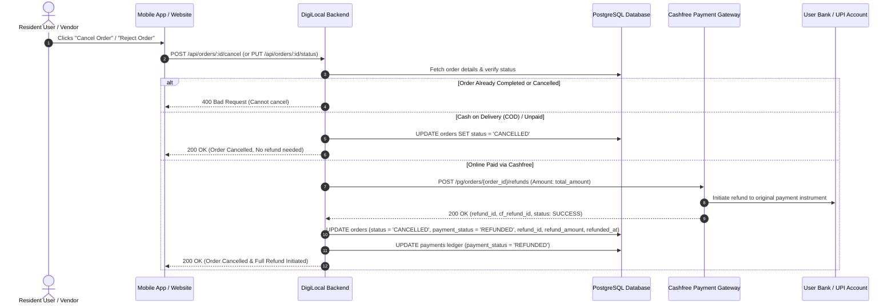

# DigiLocal Order Cancellation & Automated Source Refund API Documentation

This document provides frontend engineers (Resident Mobile App, Website Storefront, and Vendor App) and backend administrators with the complete technical specifications for **Order Cancellation**, **Automated Cashfree Source Refunds**, **Ledger Updates**, and **Cashfree Dashboard Configuration**.

> **Production Base URL:** `https://digi-local-backend.onrender.com`  
> **Local Base URL:** `http://localhost:5000`  
> **Webhook Endpoint:** `https://digi-local-backend.onrender.com/api/payments/cashfree/webhook`

---

## 📌 1. Overview & Refund Principles

When an order is cancelled in DigiLocal:
1. **Automated Original Payment Source Refund**:
   - If the customer paid online via Cashfree (UPI, Debit Card, Credit Card, or Net Banking), the backend communicates directly with Cashfree's Payment Gateway API (`POST /orders/{order_id}/refunds`).
   - **The refund is credited back to the customer's original payment source** (the exact UPI account, bank account, or card from which money was deducted).
   - **No manual bank account or IFSC entry** is required from the customer.
2. **Who Can Cancel?**:
   - **Resident User**: Clicks "Cancel Order" on Customer App / Web (`POST /api/orders/:id/cancel`).
   - **Merchant / Vendor**: Rejects or cancels order on Vendor App (`PUT /api/orders/:id/status` with `status: "CANCELLED"` or `"REJECTED"`).
   - **In both cases**, if the order was paid online, the customer receives an automatic refund.
3. **Cash on Delivery (COD) / Unpaid Orders**:
   - If the order was COD or unpaid, the status transitions to `CANCELLED` immediately without triggering any payment gateway refund.
4. **Safety Guards**:
   - **Completed Orders**: Orders that are already `DELIVERED` or `COMPLETED` cannot be cancelled (returns `400 Bad Request`).
   - **Duplicate Cancellation**: Orders that are already `CANCELLED` cannot be cancelled again (returns `400 Bad Request`).

---

## 🧭 2. Order Cancellation Flow Diagram



---

## 🚀 3. API Endpoints Specification

### 3.1 Resident User: Cancel Order & Auto Refund

- **Method**: `POST` (also accepts `PUT` / `PATCH`)
- **Endpoints**:
  - `POST /api/orders/:id/cancel`
  - `PUT /api/orders/:id/cancel`
  - `POST /api/orders/user/:userId/orders/:id/cancel`
- **URL Parameters**:
  - `id`: Unique order identifier (e.g. `ORD_100234` or numeric ID).
- **Request Headers**:
  ```http
  Content-Type: application/json
  Authorization: Bearer <user_jwt_token> (Optional if session-based)
  ```
- **Request Body** *(Optional)*:
  ```json
  {
    "reason": "Changed my delivery time preference"
  }
  ```

#### Success Response — Online Paid Order (Refund Completed / In Progress):
```json
{
  "success": true,
  "message": "Order cancelled successfully. A full refund of 350.00 has been initiated back to your original payment account.",
  "order_id": "ORD_100234",
  "status": "CANCELLED",
  "payment_status": "REFUND_COMPLETED",
  "refund_status": "COMPLETED",
  "refund_status_label": "Refund Completed",
  "is_refund_in_progress": false,
  "is_online_paid": true,
  "refund": {
    "refund_initiated": true,
    "refund_id": "REF_ORD_100234_1790759890361",
    "cf_refund_id": "cf_ref_9281729",
    "refund_amount": 350.00,
    "refund_currency": "INR",
    "refund_status": "COMPLETED",
    "refund_status_label": "Refund Completed",
    "is_refund_in_progress": false,
    "destination": "Original Payment Source (Bank Account / UPI / Card)",
    "note": "Changed my delivery time preference"
  }
}
```

#### ✅ Success Response — COD / Unpaid Order:
```json
{
  "success": true,
  "message": "Order cancelled successfully.",
  "order_id": "ORD_100235",
  "status": "CANCELLED",
  "payment_status": "CANCELLED",
  "is_online_paid": false,
  "refund": null
}
```

#### ❌ Error Responses:
- **Order already completed / delivered** (`400 Bad Request`):
  ```json
  {
    "success": false,
    "error": "Cannot cancel an order that has already been delivered or completed",
    "order_id": "ORD_100234",
    "status": "COMPLETED"
  }
  ```
- **Order already cancelled** (`400 Bad Request`):
  ```json
  {
    "success": false,
    "error": "Order is already cancelled",
    "order_id": "ORD_100234",
    "status": "CANCELLED",
    "payment_status": "REFUNDED"
  }
  ```
- **Order not found** (`404 Not Found`):
  ```json
  {
    "success": false,
    "error": "Order ID 'ORD_999999' not found"
  }
  ```

---

### 3.2 Vendor: Reject or Cancel Order Pipeline

Vendors can cancel or reject an order from the Vendor App or Merchant Web Portal using the standard status update pipeline or the cancel endpoint:

- **Method**: `PUT` / `POST` / `PATCH`
- **Endpoints**:
  - `PUT /api/orders/:id/status`
  - `PUT /api/vendors/:vendorId/orders/:id/status`
  - `POST /api/orders/:id/cancel`
- **Request Body**:
  ```json
  {
    "status": "CANCELLED",
    "reason": "Out of stock for requested items"
  }
  ```
  *(Allowed values for rejection/cancellation: `"CANCELLED"`, `"CANCELED"`, `"REJECTED"`, `"DECLINED"`)*.

#### ✅ Success Response (When customer paid online):
```json
{
  "success": true,
  "message": "Order status updated to CANCELLED. Refund of ₹350.00 initiated to customer original account.",
  "order_id": "ORD_100234",
  "status": "CANCELLED",
  "payment_status": "REFUNDED",
  "raw_status": "CANCELLED",
  "refund": {
    "success": true,
    "refund_id": "REF_ORD_100234_1790759890361",
    "cf_refund_id": "cf_ref_9281729",
    "order_id": "CF_ORD_100234",
    "refund_amount": 350.00,
    "refund_currency": "INR",
    "refund_status": "SUCCESS",
    "destination": "ORIGINAL_PAYMENT_SOURCE"
  }
}
```

---

### 3.3 Admin / Support: Programmatic Manual Refund Trigger

For customer support or disputes where a manual refund needs to be initiated directly:

- **Method**: `POST`
- **Endpoint**: `/api/payments/cashfree/refund`
- **Request Body**:
  ```json
  {
    "order_id": "ORD_100234",
    "amount": 350.00,
    "reason": "Customer dispute resolution / manual refund"
  }
  ```
- **Response**:
  ```json
  {
    "success": true,
    "message": "Refund of ₹350.00 initiated successfully to customer original payment account.",
    "order_id": "ORD_100234",
    "refund": {
      "success": true,
      "refund_id": "REF_ORD_100234_1790759974158",
      "cf_refund_id": "cf_ref_9281730",
      "order_id": "ORD_100234",
      "refund_amount": 350.00,
      "refund_currency": "INR",
      "refund_status": "SUCCESS",
      "destination": "ORIGINAL_PAYMENT_SOURCE"
    }
  }
  ```

---

### 3.4 Single Order Detail & Refund Tracking

To inspect the refund status of an order:

- **Method**: `GET`
- **Endpoint**: `/api/orders/:orderId`
- **Response**:
  ```json
  {
    "order": {
      "order_id": "ORD_100234",
      "user_id": "usr_928172",
      "vendor_id": 14,
      "total_amount": 350.00,
      "status": "CANCELLED",
      "payment_status": "REFUNDED",
      "payment_method": "CASHFREE",
      "refund_id": "REF_ORD_100234_1790759890361",
      "refund_amount": 350.00,
      "refund_status": "SUCCESS",
      "refunded_at": "2026-09-30T14:48:30.000Z",
      "created_at": "2026-09-30T14:30:00.000Z"
    },
    "items": [
      {
        "item_id": 42,
        "item_name": "Cold Coffee Large",
        "quantity": 2,
        "price": 175.00
      }
    ]
  }
  ```

---

## 🗄️ 4. Database Schema Reference

The following columns track refunds in the PostgreSQL database:

### `orders` Table
| Column Name | Data Type | Description |
| :--- | :--- | :--- |
| `status` | `VARCHAR(50)` | Set to `'CANCELLED'` |
| `payment_status` | `VARCHAR(50)` | Set to `'REFUNDED'` for prepaid, or `'CANCELLED'` for COD |
| `refund_id` | `VARCHAR(100)` | Unique refund reference string |
| `refund_amount` | `DECIMAL(10,2)` | Amount refunded in INR |
| `refund_status` | `VARCHAR(50)` | `'SUCCESS'`, `'PENDING'`, or `'FAILED'` |
| `refunded_at` | `TIMESTAMP` | ISO timestamp when refund was completed |

### `payments` Table
| Column Name | Data Type | Description |
| :--- | :--- | :--- |
| `payment_status` | `VARCHAR(50)` | Updated from `'SUCCESS'` to `'REFUNDED'` |
| `refund_id` | `VARCHAR(100)` | Matches the order refund ID |
| `refund_amount` | `DECIMAL(10,2)` | Amount refunded |
| `refunded_at` | `TIMESTAMP` | Timestamp of refund |

---

## 📱 5. Frontend & App Developer Implementation Guide

### A. Resident User App (React Native / Flutter / Web)
1. **Cancel Button Visibility**:
   - Display the "Cancel Order" button only when `order.status` is in `['PLACED', 'PENDING', 'ACCEPTED', 'CONFIRMED']`.
   - Hide or disable the button once `order.status` reaches `IN_PROGRESS`, `OUT_FOR_DELIVERY`, or `COMPLETED`.
2. **Confirmation Dialog**:
   - If `order.payment_status === 'PAID'`, show:
     > *"Are you sure you want to cancel? Since this order was paid online, ₹{order.total_amount} will be automatically refunded back to your bank account / UPI."*
   - If `order.payment_method === 'COD'`, show:
     > *"Are you sure you want to cancel this order?"*
3. **API Call**:
   ```javascript
   async function handleCancelOrder(orderId, cancelReason) {
     try {
       const res = await fetch(`https://digi-local-backend.onrender.com/api/orders/${orderId}/cancel`, {
         method: 'POST',
         headers: { 'Content-Type': 'application/json' },
         body: JSON.stringify({ reason: cancelReason || 'Customer requested cancel' })
       });
       const data = await res.json();
       
       if (data.success) {
         if (data.is_online_paid && data.refund) {
           showToast(`Order Cancelled. Full refund of ₹${data.refund.refund_amount} initiated to your original payment account.`);
         } else {
           showToast('Order cancelled successfully.');
         }
         // Refresh order details or update local state
         updateLocalOrderStatus(orderId, 'CANCELLED', data.payment_status);
       } else {
         showErrorToast(data.error || 'Failed to cancel order');
       }
     } catch (err) {
       showErrorToast('Network error while cancelling order');
     }
   }
   ```
4. **Order Status Badge UI**:
   - If `status === 'CANCELLED'` and `payment_status === 'REFUNDED'`:
     - Show **Cancelled** badge (Red/Gray).
     - Show **Refunded: ₹{refund_amount}** badge (Green/Blue) with tooltip: *"Credited back to original payment account"*.

---

### B. Vendor Merchant App
1. **Reject Order Button**:
   - On incoming orders screen, when vendor clicks "Reject Order" or "Cancel":
   - Vendor selects a reason from dropdown (e.g., *"Out of stock"*, *"Store closed"*, *"Unable to deliver"*).
   - Call `PUT /api/orders/:id/status` with `{"status": "CANCELLED", "reason": selectedReason}`.
2. **No Manual Action Required**:
   - The vendor does **not** need to ask the customer for bank details or initiate a payout. The backend automatically refunds the customer directly via Cashfree.

---

## ⚙️ 6. Cashfree Dashboard Configuration Guide

Follow these steps to ensure live refunds execute smoothly without errors in production:

### 1. Webhook Setup
1. Log in to your [Cashfree Merchant Dashboard](https://merchant.cashfree.com/).
2. Navigate to **Payment Gateway** &rarr; **Developers** &rarr; **Webhooks**.
3. Click **Add Webhook Endpoint**:
   - **Endpoint URL**: `https://digi-local-backend.onrender.com/api/payments/cashfree/webhook`
   - **API Version**: `2023-08-01`
4. Select the following events:
   - `ORDER_REFUND_SUCCESS`
   - `ORDER_REFUND_FAILED`
   - `PAYMENT_SUCCESS_WEBHOOK`
5. Click **Save** and verify the webhook is active.

### 2. Settlement & Refund Balance Reserve
- In Cashfree PG, customer refunds are deducted from your **Settlement Balance** (payments collected from customers that are waiting to be settled to your current account).
- If your settlement balance is empty (₹0) and you have daily auto-settlement enabled, refunds can fail with `INSUFFICIENT_BALANCE`.
- **How to prevent this**:
  1. Go to **Settings** &rarr; **Settlements** in the Cashfree dashboard.
  2. Enable a **Refund Reserve** (e.g., hold back ₹5,000–₹10,000 in your Cashfree account) so customer refunds are always processed instantly.
  3. Alternatively, link a **Payout / Recharge Balance** to auto-fund customer refunds.

### 3. Environment Variables (.env)
Verify your production `.env` is configured with valid Live credentials:
```env
# Cashfree PG Credentials
CASHFREE_APP_ID=your_live_app_id
CASHFREE_SECRET_KEY=your_live_secret_key
CASHFREE_ENV=PRODUCTION
```
*(During development or testing, set `CASHFREE_ENV=SANDBOX` with sandbox keys; the backend automatically runs in simulation/sandbox mode without charging real money).*

---

## 🧪 7. Test Scenarios Verified

The implementation includes full automated test coverage in [`tests/orderCancelRefund.test.js`](file:///c:/Users/LENOVO/Desktop/digilocal_backend_mock/tests/orderCancelRefund.test.js):
1. **Online Prepaid Order Cancel**: Triggers Cashfree source refund, updates order to `CANCELLED`, sets `payment_status = 'REFUNDED'`, stores `refund_id` and `refund_amount`.
2. **Double Cancel Guard**: Duplicate cancellation attempts on already cancelled orders return `400 Bad Request`.
3. **COD Order Cancel**: Cancels order without attempting any payment gateway refund.
4. **Delivered Order Guard**: Attempts to cancel delivered/completed orders are rejected with `400 Bad Request`.
5. **Programmatic Refund**: Direct refund controller `/api/payments/cashfree/refund` executes and stores refund trail.
