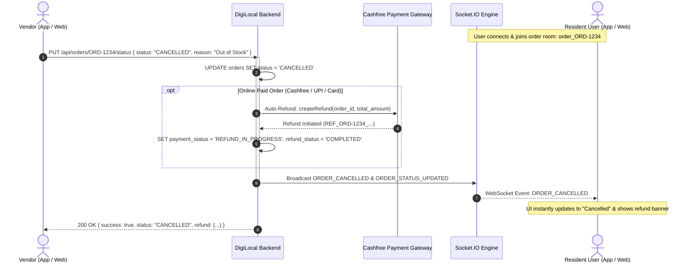

# DigiLocal Order Cancellation & Real-Time Sync API Documentation
**Target Audience:** Frontend Engineers (Vendor Website/App & User Resident Website/App)  
**Base URL:** `https://digi-local-backend.onrender.com` (Production) / `http://localhost:5000` (Local)  
**Real-Time Engine:** Socket.IO v4.x (WebSocket / HTTP Long-Polling)  

---

## 1. Overview & Architecture

When a **Vendor cancels an order** (due to stock unavailability, store closing, or delivery issues):
1. **Vendor Action**: The vendor clicks "Reject Order" or "Cancel Order" in the Vendor Portal or App, providing an optional cancellation reason.
2. **Backend Processing**:
   - The order `status` immediately transitions to **`CANCELLED`**.
   - **Automated Online Refund**: If the customer paid online via Cashfree / UPI / Card, the backend automatically initiates a full refund to the customer's original payment source and sets `payment_status = 'REFUND_IN_PROGRESS'` (or `'REFUND_COMPLETED'`) and `refund_status = 'COMPLETED'`. For COD orders, payment status transitions to `CANCELLED`.
   - **Push Notification**: Triggers an instant notification to the resident customer.
3. **Real-Time Synchronization to User Panel**:
   - The backend broadcasts **`ORDER_CANCELLED`** and **`ORDER_STATUS_UPDATED`** over **Socket.IO** directly to:
     - `order_{order_id}` (any client actively viewing that specific order screen)
     - `user_{user_id}` (the customer's global account channel)
     - `vendor_{vendor_id}` (the merchant's store channel)
   - The User Website / App receives this event in real-time, immediately updates the UI order status to **Cancelled**, displays the cancellation reason, and informs the customer of their refund progress without needing a page refresh.
   - For clients without active WebSockets, polling `GET /api/orders/:orderId` or `GET /api/orders/user/:userId` provides the exact updated status.



---

## 2. Vendor Website / App: How to Cancel an Order

Vendors can cancel an order via either the general order status pipeline endpoint or the dedicated vendor-scoped order endpoint.

### Primary Endpoint: Update Status to CANCELLED
- **Method:** `PUT` (also accepts `PATCH` or `POST`)
- **URL:** `/api/orders/:id/status`  
  *(Alternative alias: `/api/vendors/:vendorId/orders/:orderId/status`)*
- **Headers:**
  ```http
  Authorization: Bearer <VENDOR_JWT_TOKEN>
  Content-Type: application/json
  ```

### Request Body:
```json
{
  "status": "CANCELLED",
  "reason": "Item out of stock"
}
```

> **Note on Accepted Status Values:** The backend accepts `"CANCELLED"`, `"CANCELED"`, `"REJECTED"`, or `"DECLINED"`. All map canonically to **`"CANCELLED"`**.

### Alternative Dedicated Cancel Endpoint:
- **Method:** `POST`
- **URL:** `/api/orders/:id/cancel`
- **Request Body:**
  ```json
  {
    "reason": "Store is closing early today"
  }
  ```

---

### Response Payload (`200 OK`):

#### A. For Online-Paid Orders (Auto-Refund Initiated):
```json
{
  "success": true,
  "message": "Order status updated to CANCELLED. Refund of ₹350 is in progress to customer original account.",
  "order_id": "ORD-5421",
  "status": "CANCELLED",
  "payment_status": "REFUND_IN_PROGRESS",
  "refund_status": "COMPLETED",
  "refund_status_label": "Refund in Progress (Crediting back to original payment source)",
  "is_refund_in_progress": true,
  "raw_status": "CANCELLED",
  "refund": {
    "success": true,
    "refund_id": "REF_ORD-5421_1727784000123",
    "cf_refund_id": "cf_ref_987654321",
    "refund_amount": 350.00,
    "refund_currency": "INR",
    "refund_status": "COMPLETED",
    "refund_status_label": "Refund in Progress (Crediting back to original payment source)",
    "is_refund_in_progress": true,
    "destination": "Original Payment Source (Bank Account / UPI / Card)",
    "note": "Item out of stock"
  }
}
```

#### B. For Cash on Delivery (COD) Orders:
```json
{
  "success": true,
  "message": "Order status updated successfully",
  "order_id": "ORD-5421",
  "status": "CANCELLED",
  "payment_status": "CANCELLED",
  "refund_status": null,
  "refund_status_label": null,
  "is_refund_in_progress": false,
  "raw_status": "CANCELLED",
  "refund": null
}
```

---

## 3. User Website / App: How to Show Order is Cancelled

The User Frontend has two primary ways to display the cancelled order:
1. **Real-Time via WebSockets (Instant, No Refresh Required)** — **Recommended**
2. **REST API Polling / Navigation Fetch** — For initial screen load and fallback

---

### 3.1 Real-Time Synchronization via Socket.IO

The DigiLocal backend runs a Socket.IO server on port 5000 / Production URL. When the user opens an active order screen or their order list, subscribe to the order's channel.

#### Step 1: Connect to Socket.IO and Join Room
```javascript
import { io } from 'socket.io-client';

const socket = io('https://digi-local-backend.onrender.com', {
  transports: ['websocket', 'polling']
});

// When entering Order Tracking Screen:
const orderId = 'ORD-5421';
socket.emit('join_order_room', orderId);

// Optionally join the user's personal channel (receives all user updates):
const userId = '105'; // Customer's user_id or phone
socket.emit('join_user_room', userId);
```

#### Step 2: Listen for Cancellation & Status Updates
```javascript
// 1. Listen for canonical cancellation event
socket.on('ORDER_CANCELLED', (payload) => {
  console.log('⚠️ [ORDER CANCELLED EVENT]:', payload);
  /*
    payload structure:
    {
      order_id: "ORD-5421",
      status: "CANCELLED",
      payment_status: "REFUND_IN_PROGRESS",
      refund_status: "COMPLETED",
      refund_status_label: "Refund in Progress (Crediting back to original payment source)",
      is_refund_in_progress: true,
      cancel_reason: "Item out of stock",
      updated_at: "2026-10-01T11:58:00.000Z"
    }
  */

  // Update UI State:
  setCurrentOrderStatus('CANCELLED');
  setCancelReason(payload.cancel_reason || 'Store was unable to fulfill this order');
  setRefundInfo({
    status: payload.payment_status,
    label: payload.refund_status_label || 'Refund initiated to your original payment method'
  });

  // Display user alert
  alert(`Order #${payload.order_id} has been cancelled by the merchant. Reason: ${payload.cancel_reason || 'Out of stock'}`);
});

// 2. Also listen for general status changes
socket.on('ORDER_STATUS_UPDATED', (payload) => {
  if (payload.status === 'CANCELLED') {
    setCurrentOrderStatus('CANCELLED');
  }
});
```

#### Step 3: Cleanup on Screen Unmount
```javascript
useEffect(() => {
  socket.emit('join_order_room', orderId);

  socket.on('ORDER_CANCELLED', handleOrderCancelled);

  return () => {
    socket.off('ORDER_CANCELLED', handleOrderCancelled);
  };
}, [orderId]);
```

---

### 3.2 REST API: Single Order Tracking Lookup

When the user opens the order detail page or refreshes the screen:

- **Method:** `GET`
- **URL:** `/api/orders/:orderId`  
  *(e.g., `GET /api/orders/ORD-5421`)*
- **Headers:** `Authorization: Bearer <TOKEN>`

#### Response (`200 OK`):
```json
{
  "order": {
    "order_id": "ORD-5421",
    "user_id": "105",
    "vendor_id": "1430",
    "society_id": "1",
    "total_amount": 350.00,
    "status": "CANCELLED",
    "payment_method": "CASHFREE",
    "payment_status": "REFUND_IN_PROGRESS",
    "refund_id": "REF_ORD-5421_1727784000123",
    "refund_amount": 350.00,
    "refund_status": "COMPLETED",
    "refund_status_label": "Refund in Progress (Crediting back to original payment source)",
    "is_refund_in_progress": true,
    "customer_name": "Pooja Sharma",
    "customer_phone": "9876543210",
    "delivery_address": "Flat 402, Tower B, Express Greens",
    "created_at": "2026-10-01T11:45:00.000Z"
  },
  "items": [
    {
      "id": 890,
      "order_id": "ORD-5421",
      "item_id": 45,
      "item_name": "Amul Taaza Milk 500ml",
      "quantity": 2,
      "price": 27.00
    },
    {
      "id": 891,
      "order_id": "ORD-5421",
      "item_id": 62,
      "item_name": "Brown Bread 400g",
      "quantity": 1,
      "price": 50.00
    }
  ]
}
```

---

### 3.3 REST API: User Orders History List

To show cancelled orders in the customer's "My Orders" tab:

- **Method:** `GET`
- **URL:** `/api/orders/user/:userId`  
  *(Alternative alias: `/api/orders?user_id=:userId`)*
- **Headers:** `Authorization: Bearer <TOKEN>`

#### UI Recommendations for User Panel Frontend:
1. **Status Badge**: If `order.status === 'CANCELLED'`, render a Red/Rose badge: `<span className="badge badge-cancelled">Cancelled</span>`.
2. **Refund Status Chip**:
   - If `order.payment_status === 'REFUND_IN_PROGRESS'`: Show `<span className="badge badge-warning">Refund Processing (3-5 days)</span>`.
   - If `order.payment_status === 'REFUND_COMPLETED'`: Show `<span className="badge badge-success">Refunded</span>`.
   - If COD: Show `Cancelled (No payment was charged)`.
3. **Cancellation Details Section**:
   - Display: `"Order cancelled by store: Out of stock"`.

---

## 4. Complete Frontend Code Examples

### A. Vendor Panel: Cancelling an Order (React / Next.js)
```javascript
import axios from 'axios';

const API_BASE = 'https://digi-local-backend.onrender.com';

export async function cancelOrderByVendor(orderId, vendorToken, cancelReason = 'Store unable to fulfill') {
  try {
    const response = await axios.put(
      `${API_BASE}/api/orders/${orderId}/status`,
      {
        status: 'CANCELLED',
        reason: cancelReason
      },
      {
        headers: {
          'Authorization': `Bearer ${vendorToken}`,
          'Content-Type': 'application/json'
        }
      }
    );
    return response.data;
  } catch (error) {
    console.error('Failed to cancel order:', error.response?.data || error.message);
    throw error.response?.data || error;
  }
}
```

---

### B. User Panel: Order Tracking Screen with Real-Time Updates (React / Next.js)
```jsx
import React, { useEffect, useState } from 'react';
import axios from 'axios';
import { io } from 'socket.io-client';

const SOCKET_URL = 'https://digi-local-backend.onrender.com';
const API_BASE = 'https://digi-local-backend.onrender.com';

export default function OrderTrackingPage({ orderId, userToken }) {
  const [order, setOrder] = useState(null);
  const [loading, setLoading] = useState(true);

  // 1. Initial REST API Fetch
  useEffect(() => {
    async function fetchOrder() {
      try {
        const res = await axios.get(`${API_BASE}/api/orders/${orderId}`, {
          headers: { Authorization: `Bearer ${userToken}` }
        });
        setOrder(res.data.order);
      } catch (err) {
        console.error('Error fetching order:', err);
      } finally {
        setLoading(false);
      }
    }
    fetchOrder();
  }, [orderId, userToken]);

  // 2. Real-Time Socket.IO Synchronization
  useEffect(() => {
    const socket = io(SOCKET_URL, {
      transports: ['websocket', 'polling']
    });

    // Join room for this specific order
    socket.emit('join_order_room', orderId);

    // Listen for order cancellation
    socket.on('ORDER_CANCELLED', (payload) => {
      console.log('Real-time cancellation received:', payload);
      setOrder((prev) => ({
        ...prev,
        status: 'CANCELLED',
        payment_status: payload.payment_status,
        refund_status: payload.refund_status,
        refund_status_label: payload.refund_status_label,
        is_refund_in_progress: payload.is_refund_in_progress,
        cancel_reason: payload.cancel_reason
      }));
    });

    // Listen for general status update
    socket.on('ORDER_STATUS_UPDATED', (payload) => {
      setOrder((prev) => ({
        ...prev,
        status: payload.status,
        payment_status: payload.payment_status,
        refund_status: payload.refund_status,
        refund_status_label: payload.refund_status_label
      }));
    });

    return () => {
      socket.disconnect();
    };
  }, [orderId]);

  if (loading) return <div>Loading order status...</div>;
  if (!order) return <div>Order not found</div>;

  return (
    <div className="order-details-card">
      <h2>Order #{order.order_id}</h2>
      
      {/* Dynamic Status Banner */}
      {order.status === 'CANCELLED' ? (
        <div className="alert-cancelled" style={{ backgroundColor: '#FEE2E2', border: '1px solid #EF4444', padding: '16px', borderRadius: '8px' }}>
          <h3 style={{ color: '#B91C1C', margin: 0 }}>Order Cancelled</h3>
          <p style={{ color: '#7F1D1D', marginTop: '8px' }}>
            {order.cancel_reason || 'The merchant cancelled this order.'}
          </p>
          {order.is_refund_in_progress && (
            <div style={{ marginTop: '8px', color: '#047857', fontWeight: 600 }}>
              💳 {order.refund_status_label || 'Refund initiated back to your original payment method.'}
            </div>
          )}
        </div>
      ) : (
        <div className="status-badge">Status: {order.status}</div>
      )}
    </div>
  );
}
```

---

## 5. Explanation: Why Did `1430/subscription-status` Throw 404?

In the logs / network inspector screenshots:
- `GET https://digi-local-backend.onrender.com/api/vendorPanel/1430/subscription-status` ➔ **404 Not Found**
- `GET https://digi-local-backend.onrender.com/api/subscriptions/status/1430` ➔ **404 Not Found**

### Root Causes:
1. **Render Production vs Local Code**:
   - The requests were sent to the live deployed URL: `https://digi-local-backend.onrender.com`.
   - Render automatically pulls code from the **GitHub repository**.
   - The subscription module (`subscriptionService.js`, `subscriptionController.js`, and its route bindings) was developed locally and **has not yet been committed and pushed to git / deployed to Render**.
   - Therefore, the live Render server was running an earlier commit where those routes did not exist.
2. **Route Aliasing Gaps**:
   - While `/api/vendorPanel/:vendorId/subscription-status` was registered on `vendorPanelRoutes.js`, the vendor auth routes (`/api/vendors/:vendorId/subscription-status` and `/api/subscriptions/status/:vendorId`) lacked unified direct route aliases.
   - We have now added unified aliases in [`src/routes/index.js`](file:///c:/Users/LENOVO/Desktop/digilocal_backend_mock/src/routes/index.js) and [`src/routes/Vendor/vendorAuthRoutes.js`](file:///c:/Users/LENOVO/Desktop/digilocal_backend_mock/src/routes/Vendor/vendorAuthRoutes.js):
     - `GET /api/vendorPanel/:vendorId/subscription-status`
     - `GET /api/vendors/:vendorId/subscription-status`
     - `GET /api/vendor/:vendorId/subscription-status`
     - `GET /api/subscriptions/status/:vendorId`
     - `GET /api/subscriptions/:vendorId/status`

Once the changes are committed and pushed to GitHub, Render will trigger a new deployment and these endpoints will return `200 OK`.
