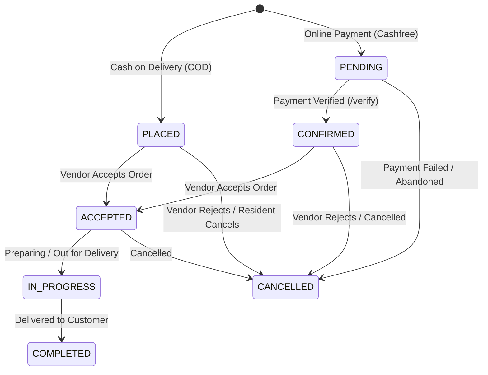

# DigiLocal Order Status & Lifecycle API Documentation

This document provides frontend engineers (Web, React Native / Expo, and Vendor Panel) with complete integration specifications for **Order Status Transitions**, **Lifecycle State Machine**, **Tracking APIs**, and **Live Alerts**.

---

## 🧭 1. Order Status State Machine & Workflow



### 1.1 Canonical Status Definitions (Database & Backend)

| Canonical Status | Stage Description | Typical Trigger |
| :--- | :--- | :--- |
| `PLACED` | Order created via COD; awaiting vendor review & acceptance | Customer clicks "Place Order" (COD) |
| `PENDING` | Order created via Cashfree; awaiting online transaction completion | Customer proceeds to Cashfree Gateway |
| `CONFIRMED` | Online payment completed and verified; awaiting vendor acceptance | Successful `POST /api/payments/cashfree/verify` |
| `ACCEPTED` | Vendor reviewed and accepted the order | Vendor clicks "Accept Order" |
| `IN_PROGRESS` | Order is being prepared or is out for delivery | Vendor/Rider marks "Out for Delivery" |
| `COMPLETED` | Order successfully delivered to resident | Vendor/Rider marks "Delivered" |
| `CANCELLED` | Order cancelled by user or declined/rejected by vendor | Either party clicks "Cancel / Reject" |

---

## 🔄 2. Backend Normalization & Allowed Inputs

To make frontend development seamless, the DigiLocal backend accepts multiple industry-standard status terms and normalizes them automatically into canonical database values.

### Input Mapping Table

| Frontend Can Send | Normalized Database Status | Returned in Response |
| :--- | :--- | :--- |
| `"ACCEPTED"`, `"ACCEPT"`, `"CONFIRMED"`, `"PREPARING"` | `ACCEPTED` | `status: "ACCEPTED"` |
| `"OUT_FOR_DELIVERY"`, `"IN_PROGRESS"`, `"PROCESSING"` | `IN_PROGRESS` | `status: "IN_PROGRESS"` |
| `"DELIVERED"`, `"COMPLETED"`, `"COMPLETE"`, `"FULFILLED"`, `"DONE"` | `COMPLETED` | `status: "COMPLETED"` |
| `"CANCELLED"`, `"CANCELED"`, `"REJECTED"`, `"DECLINED"` | `CANCELLED` | `status: "CANCELLED"` |
| `"PLACED"` | `PLACED` | `status: "PLACED"` |
| `"PENDING"` | `PENDING` | `status: "PENDING"` |

> 💡 **Tip for Frontend Devs**: You can send friendly labels like `"OUT_FOR_DELIVERY"`, `"PREPARING"`, or `"DELIVERED"`, and the backend handles both mapping and validation. The backend also echoes back `raw_status` so your local state knows exactly what you passed.

---

## 📡 3. Order Status Endpoints

### 3.1 Update Order Status
Updates an order's status. Supports `PUT`, `PATCH`, and `POST`.

- **Primary Route**: `PUT /api/orders/:id/status`
- **Vendor Specific Route**: `PUT /api/vendors/:vendorId/orders/:orderId/status`
- **Alternative Route**: `PUT /api/orders/vendor/:vendorId/orders/:id/status`
- **Methods**: `PUT` | `PATCH` | `POST`
- **Content-Type**: `application/json`

#### Request Parameters
- Path Param `:id` or `:orderId`: Order ID (e.g. `"ORD-5481"`)
- Body Field: `status` (or `orderStatus`, or query parameter `?status=...`)

#### Request Body Examples

**A. Vendor Accepts Order:**
```json
{
  "status": "ACCEPTED"
}
```

**B. Out for Delivery:**
```json
{
  "status": "OUT_FOR_DELIVERY"
}
```

**C. Delivered / Completed:**
```json
{
  "status": "DELIVERED"
}
```

**D. Cancelled / Declined:**
```json
{
  "status": "CANCELLED"
}
```

#### Success Response (`200 OK`)
```json
{
  "success": true,
  "message": "Order status updated successfully",
  "order_id": "ORD-5481",
  "status": "IN_PROGRESS",
  "raw_status": "OUT_FOR_DELIVERY"
}
```

#### Error Responses

- **Invalid Status (`400 Bad Request`)**:
```json
{
  "error": "Invalid order status 'SHIPPED'. Allowed statuses: PLACED, PENDING, ACCEPTED, IN_PROGRESS, COMPLETED, CANCELLED",
  "allowedStatuses": [
    "PLACED", "PENDING", "CONFIRMED", "ACCEPTED", "IN_PROGRESS", 
    "PREPARING", "OUT_FOR_DELIVERY", "DELIVERED", 
    "COMPLETED", "COMPLETE", "FULFILLED", "DONE", 
    "CANCELLED", "CANCELED", "REJECTED", "DECLINED"
  ]
}
```

- **Order Not Found (`404 Not Found`)**:
```json
{
  "error": "Order ID 'ORD-9999' not found"
}
```

---

### 3.2 Fetch Single Order Details & Status
Use this to render customer order tracking or vendor order detail modals.

- **Endpoint**: `GET /api/orders/:orderId`
- **Method**: `GET`

#### Response (`200 OK`)
```json
{
  "order": {
    "order_id": "ORD-5481",
    "user_id": "usr_9876543210",
    "vendor_id": 1296,
    "society_id": 1,
    "total_amount": "250.00",
    "status": "ACCEPTED",
    "payment_method": "COD",
    "payment_status": "PENDING",
    "cashfree_order_id": null,
    "cashfree_payment_id": null,
    "paid_at": null,
    "delivery_address": "Tower A-402, Greenwood Residency",
    "customer_name": "Aarushi Verma",
    "customer_phone": "9876543210",
    "order_timestamp": "2026-09-22T14:15:00.000Z",
    "created_at": "2026-09-22T14:15:00.000Z"
  },
  "items": [
    {
      "id": 1,
      "order_id": "ORD-5481",
      "item_id": 101,
      "item_name": "Whole Wheat Brown Bread",
      "quantity": 2,
      "price": "50.00"
    },
    {
      "id": 2,
      "order_id": "ORD-5481",
      "item_id": 102,
      "item_name": "Fresh Cow Milk 1L",
      "quantity": 3,
      "price": "50.00"
    }
  ]
}
```

---

### 3.3 Fetch Resident User Orders (Customer App)
Fetches the customer's full order history, including parsed address, formatted dates, and human-readable status labels.

- **Endpoint**: `GET /api/orders/user/:userId`
- **Alternative**: `GET /api/users/:userId/orders`
- **Method**: `GET`

#### Response Example (`200 OK`)
```json
{
  "success": true,
  "count": 1,
  "total": 1,
  "orders": [
    {
      "id": "ORD-5481",
      "order_id": "ORD-5481",
      "user_id": "usr_9876543210",
      "customer_name": "Aarushi",
      "phone": "+919784319840",
      "user_phone": "+919784319840",
      "vendor_id": 1296,
      "store_name": "FreshMart Grocery & Organic",
      "store_logo": "https://images.unsplash.com/photo-1542838132-92c53300491e",
      "society_name": "Greenwood Residency",
      "delivery_address": "Tower A-402",
      "flatNumber": "Tower A-402",
      "buildingNumber": "-",
      "subtotal": 250,
      "tax": 0,
      "deliveryCharge": 0,
      "serviceCharge": 0,
      "total": 250,
      "total_amount": 250,
      "status": "ACCEPTED",
      "status_label": "Order Paid & Out for Delivery",
      "payment_status": "PAID",
      "payment_method": "COD",
      "date": "2026-09-22T14:15:00.000+05:30",
      "timestamp": "02:15 PM",
      "createdAt": "2026-09-22T14:15:00.000+05:30",
      "created_at": "2026-09-22T14:15:00.000+05:30",
      "created_at_readable": "22 Sep 2026, 02:15 PM",
      "items": [
        {
          "item_id": 101,
          "item_name": "Whole Wheat Brown Bread",
          "quantity": 2,
          "unit_price": 50,
          "price": 50,
          "menuItem": {
            "name": "Whole Wheat Brown Bread",
            "price": 50
          }
        }
      ]
    }
  ]
}
```

> ⚠️ **Note for Resident App UI**: In `getUserOrders`, `status` is formatted in **UPPERCASE** (e.g. `"ACCEPTED"`, `"DELIVERED"`).

---

### 3.4 Fetch Vendor Store Orders (Vendor Panel / Expo App)
Fetches incoming and historical orders for a specific vendor's store.

- **Endpoint**: `GET /api/orders/vendor/:vendorId`
- **Alternative**: `GET /api/vendors/:vendorId/orders`
- **Method**: `GET`

#### Response Example (`200 OK`)
```json
[
  {
    "id": "ORD-5481",
    "order_id": "ORD-5481",
    "user_id": "usr_9876543210",
    "customer_name": "Aarushi Verma",
    "phone": "9876543210",
    "delivery_address": "Flat 402, Tower B",
    "flatNumber": "Flat 402",
    "buildingNumber": "Tower B",
    "subtotal": 250,
    "tax": 0,
    "deliveryCharge": 0,
    "serviceCharge": 0,
    "total": 250,
    "total_amount": 250,
    "status": "accepted",
    "timestamp": "02:15 PM",
    "createdAt": "2026-09-22T14:15:00.000+05:30",
    "created_at": "2026-09-22T14:15:00.000+05:30",
    "created_at_readable": "22 Sep 2026, 02:15 PM",
    "items": [
      {
        "quantity": 2,
        "item_name": "Whole Wheat Brown Bread",
        "price": 50,
        "unit_price": 50,
        "item_total": 100,
        "menuItem": {
          "name": "Whole Wheat Brown Bread",
          "price": 50
        }
      }
    ]
  }
]
```

> ⚠️ **Note for Vendor Panel App**: In `getVendorOrders`, `status` is formatted in **lowercase** (e.g. `"accepted"`, `"in_progress"`, `"completed"`). Recommend using `status.toUpperCase()` in UI code when comparing.

---

### 3.5 Filter Orders by Query Parameters
Generic order lookup supporting filtering by user phone, user ID, or vendor ID.

- **Endpoint**: `GET /api/orders`
- **Query Params**:
  * `?user_id=usr_9876543210`
  * `?phone=9876543210`
  * `?vendor_id=1296`

---

### 3.6 Trigger Vendor Push Notification & Sound Alert
When a user confirms an order via WhatsApp or requires immediate vendor alerting:

- **Endpoint**: `POST /api/orders/:id/notify`
- **Alias**: `POST /api/orders/:id/confirm-whatsapp`
- **Payload**: None required (uses order details from `:id`)

#### Response (`200 OK`)
```json
{
  "success": true,
  "message": "Vendor push notification and alert sent successfully via Firebase/Socket",
  "order_id": "ORD-5481",
  "customer_name": "Aarushi Verma",
  "total_amount": 250
}
```

---

## 🎨 4. Frontend UI Guide: Status Badges & Stepper

### 4.1 Recommended Badge Palette

| Normalized Status | Badge Label | Background Color | Text Color | Icon / Visual Indicator |
| :--- | :--- | :--- | :--- | :--- |
| `PLACED` | Order Placed | `#EFF6FF` (Blue 50) | `#1D4ED8` (Blue 700) | 🕒 Clock |
| `PENDING` | Payment Pending | `#FFFBEB` (Amber 50) | `#B45309` (Amber 700) | 💳 Card |
| `CONFIRMED` | Confirmed | `#ECFDF5` (Green 50) | `#047857` (Green 700) | ✔️ Check Circle |
| `ACCEPTED` | Accepted | `#F0FDF4` (Green 50) | `#15803D` (Green 700) | 👨‍🍳 Chef Hat / Thumbs Up |
| `IN_PROGRESS` | Out for Delivery | `#F5F3FF` (Purple 50) | `#6D28D9` (Purple 700) | 🛵 Scooter / Delivery Box |
| `COMPLETED` | Delivered | `#ECFDF5` (Emerald 50)| `#059669` (Emerald 700)| 🎉 Done / Flag |
| `CANCELLED` | Cancelled | `#FEF2F2` (Red 50) | `#B91C1C` (Red 700) | ❌ Cross |

### 4.2 Frontend Stepper Progress Index Helper

```javascript
// Helper for React / React Native Step Indicator
export function getOrderStepIndex(status) {
  const s = String(status || '').toUpperCase();
  switch (s) {
    case 'PENDING':
    case 'PLACED':
      return 0; // "Order Placed"
    case 'CONFIRMED':
    case 'ACCEPTED':
      return 1; // "Order Accepted"
    case 'IN_PROGRESS':
    case 'PREPARING':
    case 'OUT_FOR_DELIVERY':
      return 2; // "Out for Delivery"
    case 'COMPLETED':
    case 'DELIVERED':
      return 3; // "Delivered"
    case 'CANCELLED':
    case 'REJECTED':
      return -1; // "Cancelled"
    default:
      return 0;
  }
}
```

---

## ⚡ 5. Real-Time WebSocket Channel (Vendor & Live Updates)

Vendor devices and apps connect to the Socket.IO server on backend root (`http://localhost:5000` or production URL).

```javascript
import { io } from "socket.io-client";

const socket = io("http://localhost:5000");

// 1. Join Vendor Room upon authentication
socket.emit("join_vendor_room", vendorId);

// 2. Listen for Incoming Orders
socket.on("NEW_ORDER_ALERT", (orderData) => {
  console.log("New order received:", orderData);
  // Play sound chime and refresh vendor dashboard
  playAlertChime();
});
```

---

## 🚀 6. Quick Frontend API Fetch Example (Updating Status)

```javascript
// Function for Vendor App to advance status
async function advanceOrderStatus(orderId, nextStatus) {
  try {
    const res = await fetch(`http://localhost:5000/api/orders/${orderId}/status`, {
      method: "PUT",
      headers: {
        "Content-Type": "application/json"
      },
      body: JSON.stringify({ status: nextStatus })
    });

    const data = await res.json();
    if (!res.ok) {
      throw new Error(data.error || "Failed to update order status");
    }

    console.log("Status updated successfully:", data.status);
    return data;
  } catch (err) {
    console.error("Status update error:", err.message);
    throw err;
  }
}

// Usage examples:
await advanceOrderStatus("ORD-5481", "ACCEPTED");
await advanceOrderStatus("ORD-5481", "OUT_FOR_DELIVERY");
await advanceOrderStatus("ORD-5481", "DELIVERED");
```
