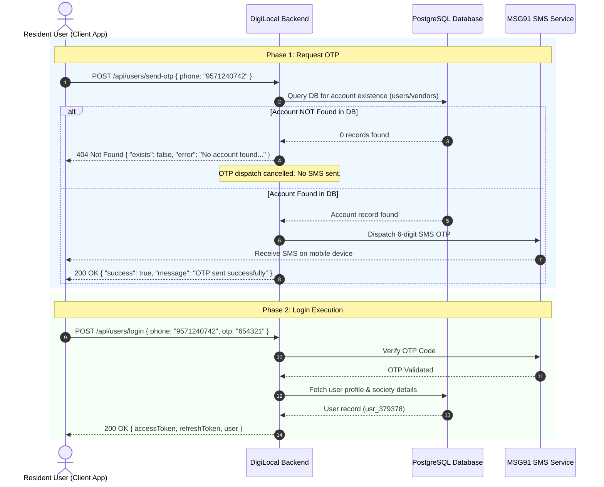

# 🔐 DigiLocal — Resident User Authentication & Login API Documentation

**Document Version:** 1.1.0  
**Target Audience:** Frontend Engineers (React Native / iOS / Android / Web App)  
**Base URL (Development):** `http://localhost:5000`  
**Base URL (Production):** `https://digi-local-backend.onrender.com`  

---

## 📋 Table of Contents
1. [Executive Summary & Workflow](#1-executive-summary--workflow)
2. [Sequence Diagram: OTP Guarded Login Flow](#2-sequence-diagram-otp-guarded-login-flow)
3. [Endpoint Specs](#3-endpoint-specs)
   - [3.1 Trigger SMS OTP (`POST /api/users/send-otp`)](#31-trigger-sms-otp-post-apiuserssend-otp)
   - [3.2 User Login (`POST /api/users/login`)](#32-user-login-post-apiuserslogin)
   - [3.3 Check Phone Registration (`POST /api/users/check-phone`)](#33-check-phone-registration-post-apiuserscheck-phone)
   - [3.4 Verify SMS OTP (`POST /api/users/verify-otp`)](#34-verify-sms-otp-post-apiusersverify-otp)
   - [3.5 Fetch Logged-In User Profile (`GET /api/users/profile`)](#35-fetch-logged-in-user-profile-get-apiusersprofile)
4. [Supported Field Aliases](#4-supported-field-aliases)
5. [Complete Status Code & Response Payloads Dictionary](#5-complete-status-code--response-payloads-dictionary)
6. [Frontend Integration Code Examples](#6-frontend-integration-code-examples)
   - [6.1 React / React Native (Axios)](#61-react--react-native-axios)
   - [6.2 Vanilla JavaScript (Fetch API)](#62-vanilla-javascript-fetch-api)
   - [6.3 cURL Commands](#63-curl-commands)

---

## 1. Executive Summary & Workflow

The DigiLocal Resident User Authentication system provides a secure, streamlined login experience. 

### 🛡️ Pre-OTP Database Check (Important for Frontend Devs)
Before sending an SMS OTP to a user during login:
1. The backend automatically checks the database to verify if an account exists for the provided mobile number.
2. **If NO account exists**: The API **immediately blocks OTP dispatch** (no SMS is sent) and returns `HTTP 404 Not Found` with `{ "exists": false, "error": "No account found with this mobile number. Please register your account first." }`.
3. **If account exists**: The API dispatches a 6-digit SMS OTP via MSG91 and returns `HTTP 200 OK`.

---

## 2. Sequence Diagram: OTP Guarded Login Flow



---

## 3. Endpoint Specs

### 3.1 Trigger SMS OTP (`POST /api/users/send-otp`)

Triggers a 6-digit SMS OTP to the resident's mobile number.

- **HTTP Method:** `POST`
- **URL Path:** `/api/users/send-otp`
- **Auth Required:** No (Public)
- **Headers:** `Content-Type: application/json`

#### Request Body Schema
```json
{
  "phone": "9571240742",
  "purpose": "login"
}
```

| Field Name | Type | Required | Description |
|---|---|---|---|
| `phone` | `String` | **Yes** | 10-digit mobile number (Accepts: `phone`, `mobile`, `phone_number`, `identifier`) |
| `purpose` | `String` | No | Purpose of OTP: `"login"` (default) or `"register"` |
| `country_code` | `String` | No | Country dial code, default: `"91"` |

#### Success Response (`200 OK`) — Account Exists & OTP Dispatched
```json
{
  "success": true,
  "message": "OTP sent successfully",
  "target": "9571240742",
  "provider": "msg91",
  "data": {
    "request_id": "3668736b32307670796c7731",
    "type": "success"
  }
}
```

#### Error Response (`404 Not Found`) — Account Not Found in Database
```json
{
  "success": false,
  "exists": false,
  "error": "No account found with this mobile number. Please register your account first."
}
```

---

### 3.2 User Login (`POST /api/users/login`)

Authenticates the resident user using either **Password** or **MSG91 SMS OTP**.

- **HTTP Method:** `POST`
- **URL Path:** `/api/users/login`
- **Auth Required:** No (Public)
- **Headers:** `Content-Type: application/json`

#### Request Body Schema (Option A: OTP Mode)
```json
{
  "mobile": "9571240742",
  "otp": "654321"
}
```

#### Request Body Schema (Option B: Password Mode)
```json
{
  "phone": "9571240742",
  "password": "UserPassword123!"
}
```

#### Success Response (`200 OK`)
```json
{
  "token": "eyJhbGciOiJIUzI1NiIsInR5cCI6IkpXVCJ9...",
  "accessToken": "eyJhbGciOiJIUzI1NiIsInR5cCI6IkpXVCJ9...",
  "refreshToken": "eyJhbGciOiJIUzI1NiIsInR5cCI6IkpXVCJ9...",
  "user": {
    "user_id": "usr_379378",
    "name": "Rohan Mehta",
    "email": "rohan.mehta@example.com",
    "phone": "9571240742",
    "society_id": "1",
    "society_name": "Omaxe Greenwood Residency",
    "flat": "Tower A-402",
    "joined_date": "August 2026",
    "avatar": "https://images.unsplash.com/photo-1534528741775-53994a69daeb?w=200"
  }
}
```

---

### 3.3 Check Phone Registration (`POST /api/users/check-phone`)

Utility endpoint to check if a mobile number is already registered prior to initiating user flows.

- **HTTP Method:** `POST`
- **URL Path:** `/api/users/check-phone`
- **Headers:** `Content-Type: application/json`

#### Request Body Example
```json
{
  "phone": "9571240742"
}
```

#### Response Example (`200 OK`)
```json
{
  "exists": true,
  "phone": "9571240742",
  "message": "Account found"
}
```

---

### 3.4 Verify SMS OTP (`POST /api/users/verify-otp`)

Standalone endpoint to verify an OTP without triggering login.

- **HTTP Method:** `POST`
- **URL Path:** `/api/users/verify-otp`
- **Headers:** `Content-Type: application/json`

#### Request Body Example
```json
{
  "phone": "9571240742",
  "otp": "654321"
}
```

#### Response Example (`200 OK`)
```json
{
  "success": true,
  "message": "OTP verified successfully",
  "valid": true,
  "phone_number": "9571240742"
}
```

---

### 3.5 Fetch Logged-In User Profile (`GET /api/users/profile`)

Fetches user profile details for an authenticated resident user.

- **HTTP Method:** `GET`
- **URL Path:** `/api/users/profile` (or `/api/users/me`)
- **Headers:** `Authorization: Bearer <accessToken>`

#### Success Response (`200 OK`)
```json
{
  "user_id": "usr_379378",
  "name": "Rohan Mehta",
  "email": "rohan.mehta@example.com",
  "phone": "9571240742",
  "society_id": "1",
  "society_name": "Omaxe Greenwood Residency",
  "flat": "Tower A-402",
  "joined_date": "August 2026",
  "avatar": "https://images.unsplash.com/photo-1534528741775-53994a69daeb?w=200"
}
```

---

## 4. Supported Field Aliases

The backend accepts any of the following property names in request JSON bodies:

| Concept | Primary Field Name | Supported Aliases |
|---|---|---|
| **Mobile Number** | `phone` | `phone`, `mobile`, `phone_number`, `mobile_number`, `identifier` |
| **OTP Code** | `otp` | `otp`, `code`, `otp_code` |
| **Password** | `password` | `password`, `pass` |

---

## 5. Complete Status Code & Response Payloads Dictionary

| Status Code | Condition | JSON Error Response Payload |
|---|---|---|
| `200 OK` | Successful login / OTP dispatch | `{ "success": true, "accessToken": "...", "user": {...} }` |
| `400 Bad Request` | Missing mobile number | `{ "error": "Mobile number is required for OTP login" }` |
| `400 Bad Request` | Invalid/Expired OTP | `{ "error": "Invalid or expired OTP code. Please enter the correct verification code." }` |
| `401 Unauthorized` | Invalid password | `{ "error": "Invalid mobile number or password" }` |
| `404 Not Found` | Mobile number not in DB | `{ "exists": false, "error": "No account found with this mobile number. Please register your account first." }` |
| `500 Server Error` | Database/Server error | `{ "error": "User login failed due to a server error" }` |

---

## 6. Frontend Integration Code Examples

### 6.1 React / React Native (Axios)

```typescript
import axios from 'axios';

const API_BASE_URL = 'http://localhost:5000/api';

/**
 * Step 1: Send OTP to Resident User Phone (Checks DB first)
 */
export const requestLoginOtp = async (phoneNumber: string) => {
  try {
    const res = await axios.post(`${API_BASE_URL}/users/send-otp`, {
      phone: phoneNumber,
      purpose: 'login'
    });
    return { success: true, data: res.data };
  } catch (err: any) {
    const status = err.response?.status;
    const errorMessage = err.response?.data?.error || 'Failed to send OTP';
    return { success: false, status, error: errorMessage };
  }
};

/**
 * Step 2: Login with Phone & OTP Code
 */
export const loginWithOtp = async (phoneNumber: string, otpCode: string) => {
  try {
    const res = await axios.post(`${API_BASE_URL}/users/login`, {
      mobile: phoneNumber,
      otp: otpCode
    });

    const { accessToken, refreshToken, user } = res.data;

    // Attach token header for future requests
    axios.defaults.headers.common['Authorization'] = `Bearer ${accessToken}`;

    return { success: true, accessToken, refreshToken, user };
  } catch (err: any) {
    const errorMessage = err.response?.data?.error || 'Login failed';
    return { success: false, status: err.response?.status, error: errorMessage };
  }
};
```

---

### 6.2 Vanilla JavaScript (Fetch API)

```javascript
// Step 1: Send OTP
async function triggerOtp(phone) {
  const response = await fetch('http://localhost:5000/api/users/send-otp', {
    method: 'POST',
    headers: { 'Content-Type': 'application/json' },
    body: JSON.stringify({ phone, purpose: 'login' })
  });

  const data = await response.json();
  if (!response.ok) {
    alert(data.error || 'Account not found');
    return false;
  }
  console.log('OTP dispatched:', data);
  return true;
}

// Step 2: Submit OTP for Login
async function submitLogin(phone, otp) {
  const response = await fetch('http://localhost:5000/api/users/login', {
    method: 'POST',
    headers: { 'Content-Type': 'application/json' },
    body: JSON.stringify({ phone, otp })
  });

  const data = await response.json();
  if (!response.ok) {
    alert(data.error || 'Invalid OTP');
    return;
  }

  localStorage.setItem('accessToken', data.accessToken);
  console.log('User Logged In:', data.user);
}
```

---

### 6.3 cURL Commands

```bash
# 1. Request OTP (Checks DB first)
curl -X POST "http://localhost:5000/api/users/send-otp" \
     -H "Content-Type: application/json" \
     -d '{"phone": "9571240742", "purpose": "login"}'

# 2. Login with OTP
curl -X POST "http://localhost:5000/api/users/login" \
     -H "Content-Type: application/json" \
     -d '{"phone": "9571240742", "otp": "654321"}'

# 3. Fetch User Profile
curl -X GET "http://localhost:5000/api/users/profile" \
     -H "Authorization: Bearer <ACCESS_TOKEN>"
```
