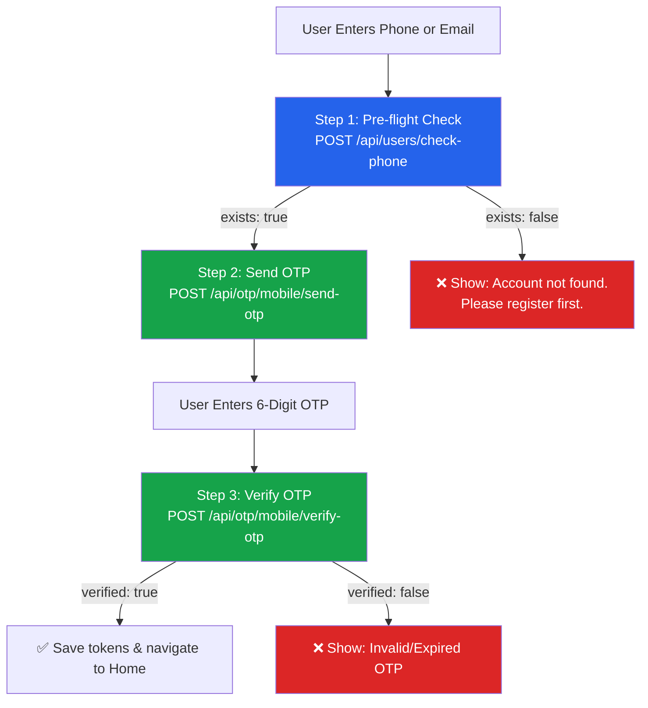

# 🔐 DigiLocal — User & Vendor Website OTP API Documentation

> **For:** Resident User Web Developer & Vendor Website Developer (React / Next.js)  
> **Base URL:** `https://digi-local-backend.onrender.com`  
> **Version:** 3.0.0  
> **Last Updated:** 28 Sep 2026

---

## ⚠️ CRITICAL: Mandatory Rules

> **Every OTP request MUST include `"role"` in the JSON body:**
> - Resident User Website → `"role": "user"`
> - Vendor Website → `"role": "vendor"`
>
> Without this, the backend will reject the request with `400 Bad Request`.

---

# 👤 Section 1: Resident User Website OTP APIs

---

## 🧭 User Login Flow



---

## 📋 Step 1: Pre-flight Account Check (RECOMMENDED)

Check if a resident user account exists before sending OTP.

### Endpoint

```
POST /api/users/check-phone
```

### Headers

```
Content-Type: application/json
```

### Request Body

```json
{
  "phone": "9571240742"
}
```

### ✅ Response — User Found (`200 OK`)

```json
{
  "exists": true,
  "phone": "9571240742",
  "message": "Account found"
}
```

### ❌ Response — User NOT Found (`200 OK`)

```json
{
  "exists": false,
  "phone": "9571240742",
  "message": "No account found with this mobile number"
}
```

> **Frontend Logic:** If `exists === false`, show error and **do NOT proceed** to Send OTP.

---

## 📱 Step 2: Send Mobile SMS OTP

Dispatches a 6-digit SMS OTP to the user's registered mobile number.

### Endpoint

```
POST /api/otp/mobile/send-otp
```

### Headers

```
Content-Type: application/json
```

### ✅ Correct Request Body

```json
{
  "phone": "9571240742",
  "country_code": "91",
  "role": "user",
  "purpose": "login"
}
```

### Field Reference

| Field | Type | Required | Description |
|---|---|---|---|
| `phone` | string | **YES** | 10-digit mobile number |
| `role` | string | **YES** | Must be `"user"` for User Website |
| `purpose` | string | **YES** | `"login"` for login, `"register"` for new sign-ups |
| `country_code` | string | Optional | Country dialing code without `+` (default: `"91"`) |

### ✅ Success Response (`200 OK`)

```json
{
  "success": true,
  "channel": "mobile_sms",
  "provider": "message_central",
  "message": "Mobile OTP sent successfully via SMS",
  "phone": "9571240742",
  "verification_id": "1790400012345",
  "verificationId": "1790400012345"
}
```

> **Important:** Save the `verification_id` — you need it in Step 3.

### ❌ Error — User NOT Registered (`404 Not Found`)

```json
{
  "success": false,
  "exists": false,
  "error": "No user account found with this mobile number. Please register your account first.",
  "message": "No user account found with this mobile number. Please register your account first."
}
```

### ❌ Error — Missing Role (`400 Bad Request`)

```json
{
  "success": false,
  "error": "\"role\" is required for login. Pass role: \"vendor\" or role: \"user\".",
  "message": "\"role\" is required for login. Pass role: \"vendor\" or role: \"user\"."
}
```

---

## ✅ Step 3: Verify Mobile OTP & Login

Verifies the 6-digit SMS code and returns JWT tokens + user profile.

### Endpoint

```
POST /api/otp/mobile/verify-otp
```

### Headers

```
Content-Type: application/json
```

### Request Body

```json
{
  "phone": "9571240742",
  "otp": "123456",
  "role": "user",
  "verification_id": "1790400012345"
}
```

### Field Reference

| Field | Type | Required | Description |
|---|---|---|---|
| `phone` | string | **YES** | Same phone number used in Send OTP |
| `otp` | string | **YES** | 6-digit numeric OTP code entered by user |
| `role` | string | **YES** | Must be `"user"` |
| `verification_id` | string | Recommended | The `verification_id` from Send OTP response |

### ✅ Success Response (`200 OK`)

```json
{
  "success": true,
  "verified": true,
  "channel": "mobile_sms",
  "provider": "message_central",
  "message": "Mobile OTP verified successfully. Login successful.",
  "phone": "9571240742",
  "role": "user",
  "token": "eyJhbGciOiJIUzI1NiIsInR5cCI6IkpXVCJ9...",
  "accessToken": "eyJhbGciOiJIUzI1NiIsInR5cCI6IkpXVCJ9...",
  "refreshToken": "eyJhbGciOiJIUzI1NiIsInR5cCI6IkpXVCJ9...",
  "user": {
    "user_id": "usr_v_1386",
    "name": "Lovely Sethiya",
    "email": "lovelysethia753@gmail.com",
    "phone": "9571240742",
    "role": "user"
  }
}
```

> **Frontend Logic:**
> - Save `accessToken` and `refreshToken` to localStorage
> - Save `user` object as the active profile
> - Navigate to Home / Dashboard

### ❌ Error — Invalid or Expired OTP (`400 Bad Request`)

```json
{
  "success": false,
  "verified": false,
  "error": "Invalid or expired mobile OTP code",
  "message": "Invalid or expired mobile OTP code"
}
```

### ❌ Error — User Not Found (`404 Not Found`)

```json
{
  "success": false,
  "verified": false,
  "exists": false,
  "error": "No user account found with this mobile number. Please register your account first.",
  "message": "No user account found with this mobile number. Please register your account first."
}
```

### ❌ Error — Account Blocked (`403 Forbidden`)

```json
{
  "success": false,
  "error": "Your resident account has been blocked by admin.",
  "message": "Your account has been blocked. Please contact customer support."
}
```

---

## 📧 Email OTP APIs (User Website)

If the user logs in via email instead of phone:

### Send Email OTP

```
POST /api/otp/email/send-otp
```

```json
{
  "email": "lovelysethia753@gmail.com",
  "role": "user",
  "purpose": "login"
}
```

**Success (`200 OK`):**
```json
{
  "success": true,
  "channel": "email",
  "provider": "aws_ses",
  "message": "OTP verification code sent to lovelysethia753@gmail.com",
  "email": "lovelysethia753@gmail.com",
  "expires_in_seconds": 600,
  "ttl_minutes": 10
}
```

### Verify Email OTP & Login

```
POST /api/otp/email/verify-otp
```

```json
{
  "email": "lovelysethia753@gmail.com",
  "otp": "123456",
  "role": "user"
}
```

**Success response** is identical to Mobile OTP verify (contains `accessToken`, `refreshToken`, `user` object).

---

## 📝 Registration OTP Flow (New User Sign-up)

When a new resident user wants to register, use `"purpose": "register"`:

### 1. Send Registration OTP

```json
POST /api/otp/mobile/send-otp
{
  "phone": "9876543210",
  "country_code": "91",
  "role": "user",
  "purpose": "register"
}
```

- If phone already exists → `400 Bad Request` ("Account already exists. Please log in instead.")
- If new phone → `200 OK` (OTP sent)

### 2. Verify Registration OTP

```json
POST /api/otp/mobile/verify-otp
{
  "phone": "9876543210",
  "otp": "123456",
  "role": "user",
  "purpose": "register",
  "verification_id": "1790400012345"
}
```

- Returns `{ "success": true, "verified": true }` — proceed to registration form submission.

> **Note:** Registration OTP verify does NOT return tokens — the user account must be created first via `POST /api/users/register`.

---

## ⚡ React / Next.js Code Example (User Website)

```javascript
import axios from 'axios';

const API = axios.create({
  baseURL: 'https://digi-local-backend.onrender.com',
  headers: { 'Content-Type': 'application/json' }
});

// ── Step 1: Pre-flight Check ────────────────────────────────
async function checkUserExists(phone) {
  const { data } = await API.post('/api/users/check-phone', { phone });
  return data.exists; // true or false
}

// ── Step 2: Send OTP ────────────────────────────────────────
async function sendOtp(phone) {
  const exists = await checkUserExists(phone);
  if (!exists) {
    throw new Error('No account found. Please register first.');
  }

  const { data } = await API.post('/api/otp/mobile/send-otp', {
    phone,
    role: 'user',          // ← MANDATORY
    purpose: 'login',      // ← MANDATORY
    country_code: '91'
  });

  return data.verification_id;
}

// ── Step 3: Verify OTP & Login ──────────────────────────────
async function verifyOtpAndLogin(phone, otpCode, verificationId) {
  const { data } = await API.post('/api/otp/mobile/verify-otp', {
    phone,
    otp: otpCode,
    role: 'user',          // ← MANDATORY
    verification_id: verificationId
  });

  if (data.success && data.verified) {
    localStorage.setItem('accessToken', data.accessToken);
    localStorage.setItem('refreshToken', data.refreshToken);
    localStorage.setItem('user', JSON.stringify(data.user));
    return data;
  }

  throw new Error(data.message || 'OTP verification failed');
}
```

---
---

# 🏪 Section 2: Vendor Website OTP APIs

> For vendors logging in via the vendor website (not the mobile app).  
> The flow is identical to the vendor app — use `"role": "vendor"` in all requests.

---

## 📋 Step 1: Pre-flight Account Check

### Endpoint

```
POST /api/vendors/check-phone
```

### Request Body (Check by Phone)

```json
{
  "phone": "9509512187"
}
```

### Request Body (Check by Email)

```json
{
  "email": "john@gmail.com"
}
```

### ✅ Response — Vendor Found (`200 OK`)

```json
{
  "exists": true,
  "is_registered": true,
  "vendor_id": 1337,
  "public_id": "vnd@1337",
  "store_name": "John",
  "vendor_name": "John",
  "phone_number": "9509512187",
  "email": "john@gmail.com",
  "status": "active",
  "message": "Vendor store account found."
}
```

### ❌ Response — Vendor NOT Found (`200 OK`)

```json
{
  "exists": false,
  "is_registered": false,
  "message": "No vendor store account found with this credential."
}
```

---

## 📱 Step 2: Send OTP

### Mobile SMS OTP

```
POST /api/otp/mobile/send-otp
```

```json
{
  "phone": "9509512187",
  "country_code": "91",
  "role": "vendor",
  "purpose": "login"
}
```

### Email OTP

```
POST /api/otp/email/send-otp
```

```json
{
  "email": "john@gmail.com",
  "role": "vendor",
  "purpose": "login"
}
```

Success/Error responses are identical to the Vendor App docs — see [VENDOR_APP_OTP_API_DOCS.md](./VENDOR_APP_OTP_API_DOCS.md).

---

## ✅ Step 3: Verify OTP & Login

### Mobile SMS OTP

```
POST /api/otp/mobile/verify-otp
```

```json
{
  "phone": "9509512187",
  "otp": "123456",
  "role": "vendor",
  "verification_id": "1790400012345"
}
```

### Email OTP

```
POST /api/otp/email/verify-otp
```

```json
{
  "email": "john@gmail.com",
  "otp": "123456",
  "role": "vendor"
}
```

Success response contains `accessToken`, `refreshToken`, `vendor` object — same as vendor app.

---

## ⚡ React / Next.js Code Example (Vendor Website)

```javascript
import axios from 'axios';

const API = axios.create({
  baseURL: 'https://digi-local-backend.onrender.com',
  headers: { 'Content-Type': 'application/json' }
});

// ── Step 1: Pre-flight Check ────────────────────────────────
async function checkVendorExists(identifier) {
  const isEmail = identifier.includes('@');
  const { data } = await API.post('/api/vendors/check-phone', {
    [isEmail ? 'email' : 'phone']: identifier
  });
  return data; // { exists, is_registered, vendor_id, ... }
}

// ── Step 2: Send OTP ────────────────────────────────────────
async function sendVendorOtp(identifier) {
  const isEmail = identifier.includes('@');
  const endpoint = isEmail
    ? '/api/otp/email/send-otp'
    : '/api/otp/mobile/send-otp';

  const { data } = await API.post(endpoint, {
    [isEmail ? 'email' : 'phone']: identifier,
    role: 'vendor',        // ← MANDATORY
    purpose: 'login',
    ...(isEmail ? {} : { country_code: '91' })
  });

  return data;
}

// ── Step 3: Verify OTP & Login ──────────────────────────────
async function verifyVendorOtp(identifier, otpCode, verificationId) {
  const isEmail = identifier.includes('@');
  const endpoint = isEmail
    ? '/api/otp/email/verify-otp'
    : '/api/otp/mobile/verify-otp';

  const { data } = await API.post(endpoint, {
    [isEmail ? 'email' : 'phone']: identifier,
    otp: otpCode,
    role: 'vendor',        // ← MANDATORY
    ...(verificationId ? { verification_id: verificationId } : {})
  });

  if (data.success && data.verified) {
    localStorage.setItem('accessToken', data.accessToken);
    localStorage.setItem('refreshToken', data.refreshToken);
    localStorage.setItem('vendor', JSON.stringify(data.vendor));
    return data;
  }

  throw new Error(data.message || 'OTP verification failed');
}
```

---

## 🔑 Using JWT Tokens for Authenticated Requests

After successful login, include the `accessToken` in all subsequent API calls:

```javascript
const token = localStorage.getItem('accessToken');

const { data } = await axios.get('https://digi-local-backend.onrender.com/api/users/profile', {
  headers: {
    'Authorization': `Bearer ${token}`
  }
});
```

---

## 🛑 HTTP Status Code Reference

| Status | Meaning | When It Happens |
|---|---|---|
| **`200 OK`** | Success | OTP sent, OTP verified, account found |
| **`400 Bad Request`** | Validation Error | Missing `role`, invalid OTP, missing fields, account already exists (registration) |
| **`403 Forbidden`** | Account Blocked | Account blocked/suspended by admin |
| **`404 Not Found`** | Not Registered | Phone/email not found in respective table |
| **`502 Bad Gateway`** | Delivery Failed | SMS provider or email SMTP failure |
| **`500 Server Error`** | Internal Error | Unhandled backend exception |
