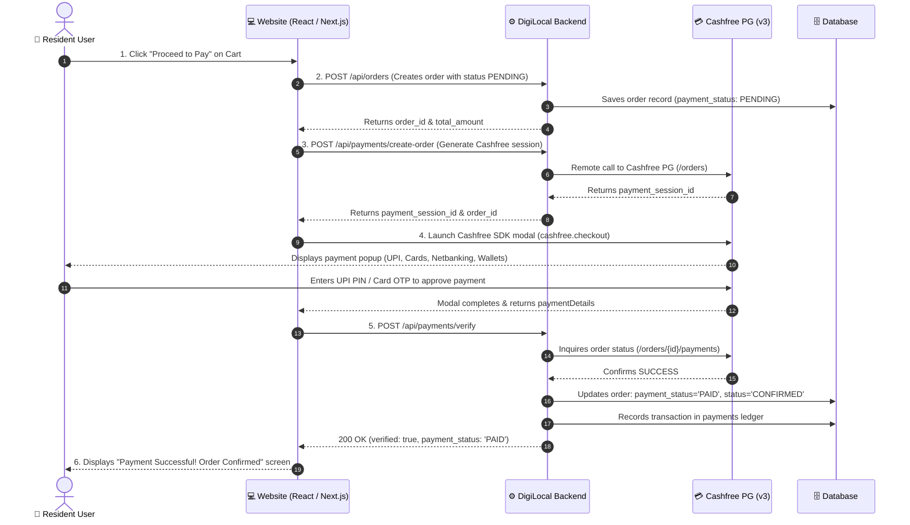

# 💳 DigiLocal — Website Payment Integration API Documentation (Production Ready)
### For: Website Frontend Developer (React / Next.js / Vue / Vanilla JS)

> **Backend Base URL (Production):** `https://digi-local-backend.onrender.com`  
> **Backend Base URL (Local Dev):** `http://localhost:5000`  
> **Payment Gateway:** Cashfree PG v3 (`2023-08-01`)  
> **Production Status:** Live & Fully Verified (Test Simulation Endpoints Removed)  
> **Last Updated:** 29 Sep 2026  

---

## 🧭 How the Payment Flow Works

When a resident user on your website purchases items from a vendor, the flow is:



---

## 📦 Step 0: Install the Cashfree JS SDK

Install the official Cashfree Web SDK in your frontend repository:

```bash
npm install @cashfreepayments/cashfree-js
```

Or via CDN script in your HTML `<head>`:
```html
<script src="https://sdk.cashfree.com/js/v3/cashfree.js"></script>
```

---

## 🔑 Environment Configuration

In your website's `.env.local` or environment variables:

| Variable | Value | Notes |
|---|---|---|
| `NEXT_PUBLIC_API_URL` (or `VITE_API_URL`) | `https://digi-local-backend.onrender.com` | Production backend |
| Cashfree SDK Mode | `'production'` | Set in `load({ mode: 'production' })` |

> 🔒 **Security Notice:** Never put Cashfree `app_id` or `secret_key` in the frontend code. All sensitive credentials are stored securely in the backend.

---

## 📡 API Specifications

---

### API 1 — Create Cart Order

Creates the order in the database **before** payment.

```http
POST /api/orders
Content-Type: application/json
```

#### Request Body
```json
{
  "vendor_id": 1296,
  "user_id": "usr_9876543210",
  "customer_name": "Aarushi Verma",
  "customer_phone": "9876543210",
  "customer_email": "aarushi@gmail.com",
  "delivery_address": "Flat 402, Tower B, Greenwood Residency",
  "payment_method": "CASHFREE",
  "total_amount": 200.00,
  "items": [
    { "item_id": 101, "item_name": "White Lily", "quantity": 2, "price": 40.00 },
    { "item_id": 105, "item_name": "Mango Juice", "quantity": 1, "price": 120.00 }
  ]
}
```

| Field | Type | Required | Description |
|---|---|---|---|
| `vendor_id` | number | **YES** | The vendor the user is buying from |
| `items` | array | **YES** | `[{ item_id, item_name, quantity, price }]` |
| `total_amount` | number | **YES** | Total order amount in INR |
| `payment_method` | string | **YES** | Always `"CASHFREE"` for online payment |
| `customer_name` | string | **YES** | Customer's full name |
| `customer_phone` | string | **YES** | 10-digit mobile number |
| `customer_email` | string | No | Customer's email address |
| `delivery_address` | string | No | Flat/society delivery address |
| `user_id` | string | No | Your frontend user ID (e.g. `usr_...`) |

#### Response `200 OK`
```json
{
  "success": true,
  "order_id": "ORD_1790592300123",
  "total_amount": 200.00,
  "status": "PENDING",
  "payment_status": "PENDING",
  "payment_method": "CASHFREE"
}
```

> 💾 **Save `order_id`**: You will pass this to the next steps.

---

### API 2 — Create Cashfree Payment Session

Requests a secure payment session directly from Cashfree PG servers.

```http
POST /api/payments/create-order
Content-Type: application/json
```

*Aliases: `POST /api/payments/create-order-session`, `POST /api/payments/cashfree/create-order-session`*

#### Request Body
```json
{
  "order_id": "ORD_1790592300123",
  "amount": 200.00,
  "customer_name": "Aarushi Verma",
  "customer_phone": "9876543210",
  "customer_email": "aarushi@gmail.com",
  "return_url": "https://yourwebsite.com/payment/status?order_id=ORD_1790592300123"
}
```

| Field | Type | Required | Description |
|---|---|---|---|
| `order_id` | string | **YES** | The `order_id` from API 1 |
| `amount` | number | **YES** | Must match the order amount |
| `customer_name` | string | **YES** | Resident's name |
| `customer_phone` | string | **YES** | 10-digit mobile number |
| `customer_email` | string | No | Resident's email address |
| `return_url` | string | No | Fallback redirect URL if user is redirected |

#### Response `200 OK`
```json
{
  "success": true,
  "payment_session_id": "session_A72xK9L2_live_session_token",
  "order_id": "ORD_1790592300123",
  "cf_order_id": "CF_ORD_1790592300123",
  "order_amount": 200.00,
  "order_currency": "INR",
  "payment_status": "ACTIVE",
  "payment_url": "https://payments.cashfree.com/order/#ORD_1790592300123",
  "mode": "live"
}
```

> 💾 **Save `payment_session_id`**: Pass this to the Cashfree JS SDK in Step 3.

---

### API 3 — Launch Cashfree Modal (Frontend SDK)

Launch the official Cashfree payment modal right on your website:

```javascript
import { load } from '@cashfreepayments/cashfree-js';

let cashfreeInstance = null;

// Initialize on page mount to prevent popup blocking
export async function getCashfree() {
  if (!cashfreeInstance) {
    cashfreeInstance = await load({ mode: 'production' });
  }
  return cashfreeInstance;
}

export async function openCashfreeModal(paymentSessionId, onPaid, onCancelled) {
  const cashfree = await getCashfree();

  const result = await cashfree.checkout({
    paymentSessionId: paymentSessionId,
    redirectTarget: '_modal' // Keeps user on your website
  });

  if (result.error) {
    // User closed popup or cancelled
    console.warn('Payment closed by user:', result.error.message);
    if (onCancelled) onCancelled(result.error);
    return;
  }

  if (result.paymentDetails) {
    // Payment approved! Proceed to verify on backend
    console.log('Payment completed in modal:', result.paymentDetails);
    if (onPaid) onPaid(result.paymentDetails);
  }
}
```

---

### API 4 — Verify Payment on Backend

Once the modal closes with payment completion, call this endpoint to verify with Cashfree and confirm the order:

```http
POST /api/payments/verify
Content-Type: application/json
```

*Alias: `POST /api/payments/cashfree/verify`*

#### Request Body
```json
{
  "order_id": "ORD_1790592300123"
}
```

#### Response `200 OK` — Verified Successfully
```json
{
  "success": true,
  "verified": true,
  "message": "Payment verified successfully. Order placed and awaiting vendor acceptance.",
  "order_id": "ORD_1790592300123",
  "status": "PLACED",
  "payment_status": "PAID",
  "payment_method": "CASHFREE",
  "cashfree_payment_id": "CF_PAY_928172901",
  "paid_at": "2026-09-29T10:12:44.000Z",
  "order": {
    "order_id": "ORD_1790592300123",
    "vendor_id": 1296,
    "status": "PLACED",
    "payment_status": "PAID",
    "total_amount": 200.00
  }
}
```

#### Response `400 Bad Request` — Payment Not Completed
```json
{
  "success": false,
  "verified": false,
  "payment_status": "FAILED",
  "error": "Payment status is USER_DROPPED"
}
```

---

## ⚡ Direct Resident-to-Vendor Payment (Scan & Pay)

For counter payments or paying a vendor directly (not from a cart):

### Step 1: Create Direct Session
```http
POST /api/payments/pay-vendor-direct
Content-Type: application/json
```

#### Request Body
```json
{
  "vendor_id": 1296,
  "amount": 150.00,
  "customer_name": "Aarushi Verma",
  "customer_phone": "9876543210",
  "notes": "Direct counter payment"
}
```

#### Response
```json
{
  "success": true,
  "order_id": "CF_DIR_1790592399123",
  "payment_session_id": "session_DIR_...",
  "payment_url": "https://payments.cashfree.com/order/#CF_DIR_..."
}
```

### Step 2: Verify Direct Payment
```http
POST /api/payments/verify-direct
Content-Type: application/json

{
  "order_id": "CF_DIR_1790592399123"
}
```

---

## 💻 Full React / Next.js Implementation

```tsx
import React, { useState, useEffect } from 'react';
import { load } from '@cashfreepayments/cashfree-js';

const API_BASE = process.env.NEXT_PUBLIC_API_URL || 'https://digi-local-backend.onrender.com';

export default function CheckoutPaymentButton({ cart, vendorId, user, onSuccess }) {
  const [loading, setLoading] = useState(false);
  const [statusMessage, setStatusMessage] = useState('');
  const [cashfree, setCashfree] = useState(null);

  // Pre-load SDK on component mount
  useEffect(() => {
    load({ mode: 'production' }).then(cf => setCashfree(cf));
  }, []);

  const handlePay = async () => {
    if (!cashfree) {
      alert('Payment system initializing, please try again in a second.');
      return;
    }

    try {
      setLoading(true);
      setStatusMessage('Creating order...');

      // 1. Create Order
      const orderRes = await fetch(`${API_BASE}/api/orders`, {
        method: 'POST',
        headers: { 'Content-Type': 'application/json' },
        body: JSON.stringify({
          vendor_id: vendorId,
          total_amount: cart.total,
          payment_method: 'CASHFREE',
          customer_name: user.name,
          customer_phone: user.phone,
          customer_email: user.email,
          delivery_address: user.address,
          items: cart.items
        })
      });
      const orderData = await orderRes.json();
      if (!orderData.success) throw new Error(orderData.error || 'Failed to create order');

      const orderId = orderData.order_id;
      setStatusMessage('Preparing payment session...');

      // 2. Create Cashfree Session
      const sessionRes = await fetch(`${API_BASE}/api/payments/create-order`, {
        method: 'POST',
        headers: { 'Content-Type': 'application/json' },
        body: JSON.stringify({
          order_id: orderId,
          amount: cart.total,
          customer_name: user.name,
          customer_phone: user.phone,
          customer_email: user.email
        })
      });
      const sessionData = await sessionRes.json();
      if (!sessionData.success || !sessionData.payment_session_id) {
        throw new Error(sessionData.error || 'Failed to create payment session');
      }

      setStatusMessage('Opening payment popup...');

      // 3. Launch Cashfree Modal
      const result = await cashfree.checkout({
        paymentSessionId: sessionData.payment_session_id,
        redirectTarget: '_modal'
      });

      if (result.error) {
        setLoading(false);
        setStatusMessage('Payment cancelled.');
        return;
      }

      // 4. Verify Payment with Backend
      setStatusMessage('Verifying payment status...');
      const verifyRes = await fetch(`${API_BASE}/api/payments/verify`, {
        method: 'POST',
        headers: { 'Content-Type': 'application/json' },
        body: JSON.stringify({ order_id: orderId })
      });
      const verifyData = await verifyRes.json();

      if (verifyData.verified && verifyData.payment_status === 'PAID') {
        setStatusMessage('Payment successful! Order confirmed.');
        if (onSuccess) onSuccess(verifyData);
      } else {
        throw new Error(verifyData.error || 'Payment could not be verified');
      }
    } catch (err) {
      console.error('Payment error:', err);
      alert(`Payment Error: ${err.message}`);
      setStatusMessage('');
    } finally {
      setLoading(false);
    }
  };

  return (
    <div>
      <button 
        onClick={handlePay} 
        disabled={loading}
        style={{
          background: '#059669',
          color: '#ffffff',
          padding: '14px 28px',
          borderRadius: '8px',
          fontWeight: 'bold',
          cursor: loading ? 'not-allowed' : 'pointer'
        }}
      >
        {loading ? statusMessage || 'Processing...' : `Pay ₹${cart.total} via Cashfree`}
      </button>
      {statusMessage && <p style={{ fontSize: '13px', marginTop: '6px', color: '#6b7280' }}>{statusMessage}</p>}
    </div>
  );
}
```

---

## ⚠️ Important Production Details & Developer Gotchas

1. **Preload the SDK:**  
   Always call `load({ mode: 'production' })` when the component or checkout page mounts. Do **not** call `load()` inside the click handler; browser security restrictions may block the modal popup if initialized asynchronously during a user click.

2. **Mobile Device Behavior & UPI Intent:**  
   On mobile browsers (Chrome / Safari on Android & iOS), Cashfree automatically shows UPI apps (Google Pay, PhonePe, Paytm). When the resident taps an app, the browser hands over to the UPI app and returns upon completion.

3. **Fallback Return URL (`return_url`):**  
   If a mobile browser forcibly reloads or the modal redirects instead of staying inline, provide a `return_url` in `POST /api/payments/create-order`:
   ```
   https://yourwebsite.com/checkout/status?order_id={order_id}
   ```
   When that page mounts, simply read `order_id` from the URL query and call `POST /api/payments/verify`.

4. **Webhooks Ensure Reliability:**  
   The backend is configured with Cashfree Webhooks (`POST /api/payments/webhook`). Even if the resident loses internet or closes their browser tab immediately after UPI PIN entry, Cashfree notifies our backend, and the order is automatically marked as `PAID`.

5. **Double Verification Safety:**  
   Calling `POST /api/payments/verify` multiple times is completely idempotent. If already paid, it simply returns the verified status without duplicating any ledger records.

6. **Order Query Endpoints:**  
   - Resident order status: `GET /api/orders/{order_id}`  
   - Resident order history: `GET /api/orders/user/{user_id}`  

---

## ✅ Production Readiness Checklist

- [x] Test / Simulation endpoints removed from backend router.
- [x] Production Cashfree PG v3 credentials active on Render backend.
- [x] Real-time vendor notification triggered upon verified payment.
- [x] `orders` and `payments` ledger synchronized on verification and webhook.