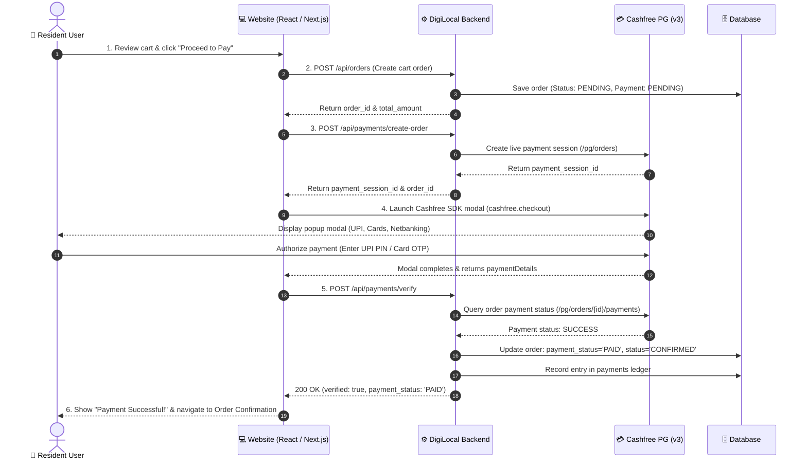

# 💳 DigiLocal — Website Cashfree Payment Integration Guide

> **For:** Resident Website Frontend Developers (React / Next.js / Vue / Vanilla JS)  
> **Base URL:** `https://digi-local-backend.onrender.com` *(or `http://localhost:5000` during local development)*  
> **Payment Gateway:** Cashfree PG v3 (`2023-08-01`)  
> **Last Updated:** 28 Sep 2026  

---

## 🧭 Complete Website Checkout & Payment Flow



---

## 📦 Step 1: Install the Cashfree Web SDK

In your frontend React / Next.js repository, install the official Cashfree JS SDK:

```bash
npm install @cashfreepayments/cashfree-js
```

*Or include via CDN in your HTML `<head>`:*
```html
<script src="https://sdk.cashfree.com/js/v3/cashfree.js"></script>
```

---

## 🔌 Step 2: API Endpoints Specification

### 1️⃣ Step 2A: Create Cart Order

Before initializing payment, generate the order in the DigiLocal backend:

#### Endpoint
```http
POST /api/orders
Content-Type: application/json
Authorization: Bearer <user_access_token>
```

#### Request Body
```json
{
  "vendor_id": 1337,
  "items": [
    { "item_id": 101, "quantity": 2, "price": 40.00 },
    { "item_id": 105, "quantity": 1, "price": 120.00 }
  ],
  "delivery_address": "Flat 402, Tower B, Greenwood Residency",
  "customer_name": "Aarushi Verma",
  "customer_phone": "9876543210"
}
```

#### Response (`200 OK`)
```json
{
  "success": true,
  "order": {
    "order_id": "ORD_1790592300123",
    "vendor_id": 1337,
    "total_amount": 200.00,
    "status": "PENDING",
    "payment_status": "PENDING"
  }
}
```

---

### 2️⃣ Step 2B: Create Cashfree Payment Session

Initialize the Cashfree checkout session for the order.

#### Endpoint
```http
POST /api/payments/create-order
Content-Type: application/json
Authorization: Bearer <user_access_token>
```

*(Aliases: `POST /api/payments/create-order-session`, `POST /api/payments/cashfree/create-order-session`)*

#### Request Body
```json
{
  "order_id": "ORD_1790592300123",
  "amount": 200.00,
  "customer_name": "Aarushi Verma",
  "customer_phone": "9876543210",
  "customer_email": "resident@gmail.com"
}
```

| Field | Type | Required | Description |
|---|---|---|---|
| `order_id` | string | **YES** | The unique order ID generated in Step 2A |
| `amount` | number | **YES** | Total amount in INR to charge the customer |
| `customer_name` | string | **YES** | Resident user's full name |
| `customer_phone` | string | **YES** | 10-digit mobile number |
| `customer_email` | string | Optional | Resident user's email address |

#### Response (`200 OK`)
```json
{
  "success": true,
  "payment_session_id": "session_g73h_f89h4_23098f_LiveSessionId",
  "order_id": "ORD_1790592300123",
  "cf_order_id": "CF_ORD_1790592300123",
  "order_amount": 200.00,
  "order_currency": "INR",
  "payment_status": "ACTIVE",
  "payment_url": "https://payments.cashfree.com/order/#ORD_1790592300123",
  "mode": "live"
}
```

> **Crucial:** Save the `payment_session_id` — you will pass it to the Cashfree JS SDK to open the checkout modal.

---

### 3️⃣ Step 2C: Verify Payment on Backend

Once the user completes the payment in the Cashfree modal, call the backend verification endpoint to confirm with Cashfree servers, mark the order as `PAID`, and record the transaction in the ledger.

#### Endpoint
```http
POST /api/payments/verify
Content-Type: application/json
Authorization: Bearer <user_access_token>
```

*(Alias: `POST /api/payments/cashfree/verify`)*

#### Request Body
```json
{
  "order_id": "ORD_1790592300123"
}
```

#### Response (`200 OK` — Payment Success)
```json
{
  "success": true,
  "verified": true,
  "order_id": "ORD_1790592300123",
  "payment_status": "PAID",
  "order_status": "CONFIRMED",
  "cashfree_payment_id": "CF_PAY_928172901",
  "payment_amount": 200.00,
  "payment_method": "UPI",
  "message": "Payment verified successfully"
}
```

#### Response (`400 Bad Request` — Payment Failed / Not Completed)
```json
{
  "success": false,
  "verified": false,
  "payment_status": "FAILED",
  "error": "Payment has not been completed or was declined"
}
```

---

## 💻 Full React / Next.js Implementation Component

Copy and paste this production-ready React component into your website frontend:

```jsx
import React, { useState } from 'react';
import axios from 'axios';
import { load } from '@cashfreepayments/cashfree-js';

// Base backend URL
const BACKEND_URL = process.env.NEXT_PUBLIC_API_URL || 'https://digi-local-backend.onrender.com';

// Cache Cashfree instance
let cashfreeInstance = null;
async function getCashfree() {
  if (!cashfreeInstance) {
    // Use 'production' for live payments or 'sandbox' for staging
    cashfreeInstance = await load({
      mode: process.env.NEXT_PUBLIC_CASHFREE_MODE || 'production'
    });
  }
  return cashfreeInstance;
}

export default function CheckoutPaymentButton({ order, user, onPaymentSuccess, onPaymentFailure }) {
  const [loading, setLoading] = useState(false);
  const [errorMessage, setErrorMessage] = useState('');

  const handlePayment = async () => {
    try {
      setLoading(true);
      setErrorMessage('');

      // 1. Request Cashfree Payment Session from DigiLocal Backend
      const token = localStorage.getItem('accessToken');
      const sessionResponse = await axios.post(
        `${BACKEND_URL}/api/payments/create-order`,
        {
          order_id: order.order_id,
          amount: Number(order.total_amount),
          customer_name: user.name || 'Resident Customer',
          customer_phone: user.phone || '9876543210',
          customer_email: user.email || 'customer@digilocal.in'
        },
        {
          headers: {
            'Content-Type': 'application/json',
            ...(token ? { Authorization: `Bearer ${token}` } : {})
          }
        }
      );

      const { payment_session_id } = sessionResponse.data;
      if (!payment_session_id) {
        throw new Error('Failed to obtain payment session from server.');
      }

      // 2. Initialize and Launch Cashfree JS Modal
      const cashfree = await getCashfree();
      const checkoutOptions = {
        paymentSessionId: payment_session_id,
        redirectTarget: '_modal' // Opens popup modal directly on page (No page reload)
      };

      const result = await cashfree.checkout(checkoutOptions);

      // Handle user dismissing or closing the modal
      if (result.error) {
        console.warn('Payment window closed or cancelled:', result.error);
        setErrorMessage(result.error.message || 'Payment was cancelled.');
        if (onPaymentFailure) onPaymentFailure(result.error);
        return;
      }

      // 3. User completed payment in modal -> Verify with Backend
      if (result.paymentDetails) {
        const verifyResponse = await axios.post(
          `${BACKEND_URL}/api/payments/verify`,
          { order_id: order.order_id },
          {
            headers: {
              'Content-Type': 'application/json',
              ...(token ? { Authorization: `Bearer ${token}` } : {})
            }
          }
        );

        if (verifyResponse.data.verified && verifyResponse.data.payment_status === 'PAID') {
          // Success! Notify parent component / navigate to order confirmation screen
          if (onPaymentSuccess) {
            onPaymentSuccess(verifyResponse.data);
          } else {
            window.location.href = `/order-confirmation?order_id=${order.order_id}`;
          }
        } else {
          throw new Error(verifyResponse.data.error || 'Payment verification failed.');
        }
      }
    } catch (err) {
      console.error('Checkout error:', err);
      const msg = err.response?.data?.error || err.message || 'Payment initiation failed.';
      setErrorMessage(msg);
      if (onPaymentFailure) onPaymentFailure(msg);
    } finally {
      setLoading(false);
    }
  };

  return (
    <div className="payment-checkout-container">
      {errorMessage && (
        <div className="p-3 mb-3 text-sm text-red-700 bg-red-100 rounded-lg">
          ⚠️ {errorMessage}
        </div>
      )}

      <button
        onClick={handlePayment}
        disabled={loading}
        className="w-full py-3.5 px-6 text-white font-semibold rounded-xl bg-gradient-to-r from-emerald-600 to-teal-600 hover:from-emerald-700 hover:to-teal-700 disabled:opacity-50 transition-all shadow-md hover:shadow-lg flex items-center justify-center gap-2"
      >
        {loading ? (
          <>
            <span className="animate-spin rounded-full h-4 w-4 border-2 border-white border-t-transparent"></span>
            Securing Payment...
          </>
        ) : (
          `Pay ₹${Number(order.total_amount).toFixed(2)} with Cashfree`
        )}
      </button>
    </div>
  );
}
```

---

## ⚡ Direct Resident-to-Vendor Payment (Scan & Pay / Bill Clearance)

If your website has a **Scan & Pay** or **Direct Vendor Pay** feature (where residents pay a vendor directly without creating a cart order first):

### 1. Initialize Direct Vendor Payment
```http
POST /api/payments/pay-vendor-direct
Content-Type: application/json
Authorization: Bearer <user_access_token>
```

#### Request Body
```json
{
  "vendor_id": 1337,
  "amount": 350.00,
  "customer_name": "Aarushi Verma",
  "customer_phone": "9876543210",
  "notes": "Weekly groceries clearance"
}
```

#### Response (`200 OK`)
```json
{
  "success": true,
  "payment_session_id": "session_direct_982348_live",
  "order_id": "CF_DIR_1790592300999",
  "order_amount": 350.00,
  "vendor_id": 1337,
  "store_name": "John Fresh Mart"
}
```

### 2. Verify Direct Payment
```http
POST /api/payments/verify-direct
Content-Type: application/json

{
  "order_id": "CF_DIR_1790592300999"
}
```

---

## 🔔 Asynchronous Webhook (`POST /api/payments/webhook`)

For payments made via UPI Intent, Netbanking, or Wallet where the user might close the browser before returning to the frontend, Cashfree automatically dispatches a webhook to the backend:

- **Endpoint:** `POST https://digi-local-backend.onrender.com/api/payments/webhook`
- **Actions handled automatically by backend:**
  - Verifies Cashfree signature.
  - Updates order status to `PAID` and `CONFIRMED`.
  - Records ledger transaction in `payments` table.
  - Sends real-time Socket.IO alert to the vendor's dashboard.

---

## 🛡️ Error Handling Matrix for Frontend Developers

| HTTP Status | Reason | What Frontend Should Display |
|---|---|---|
| **`200 OK`** | Order session created / Payment verified | Launch Cashfree modal or show Order Confirmed screen |
| **`400 Bad Request`** | Invalid amount or missing fields | Display field error message to user |
| **`400 Bad Request`** | Payment Failed / Declined | Show: *"Payment was declined by your bank. Please try another card or UPI."* |
| **`401 Unauthorized`** | Expired login token | Redirect user to Login / OTP screen |
| **`404 Not Found`** | `order_id` not found in database | Prompt user to refresh cart |
| **`500 Server Error`** | Cashfree gateway connectivity issue | Show: *"Payment gateway is momentarily busy. Please try again."* |

---

## 🔑 Backend Credentials Setup (Admin / Backend Lead)

Once you receive your production credentials from your manager, add them to `.env`:

```env
CASHFREE_APP_ID=your_cashfree_app_id
CASHFREE_SECRET_KEY=cfsk_ma_prod_xxxxxxxxxxxxxxxxxxxxxxxxxxxxxxxxxxxxxx
CASHFREE_ENV=PRODUCTION
CASHFREE_API_VERSION=2023-08-01
```

To verify live credentials connectivity at any time:
```
GET http://localhost:5000/api/payments/check-credentials
```
When valid, it returns:
```json
{
  "success": true,
  "authenticated": true,
  "status_code": 200,
  "message": "✅ Credentials are 100% VALID and successfully authenticated by Cashfree PG (PRODUCTION)!"
}
```
