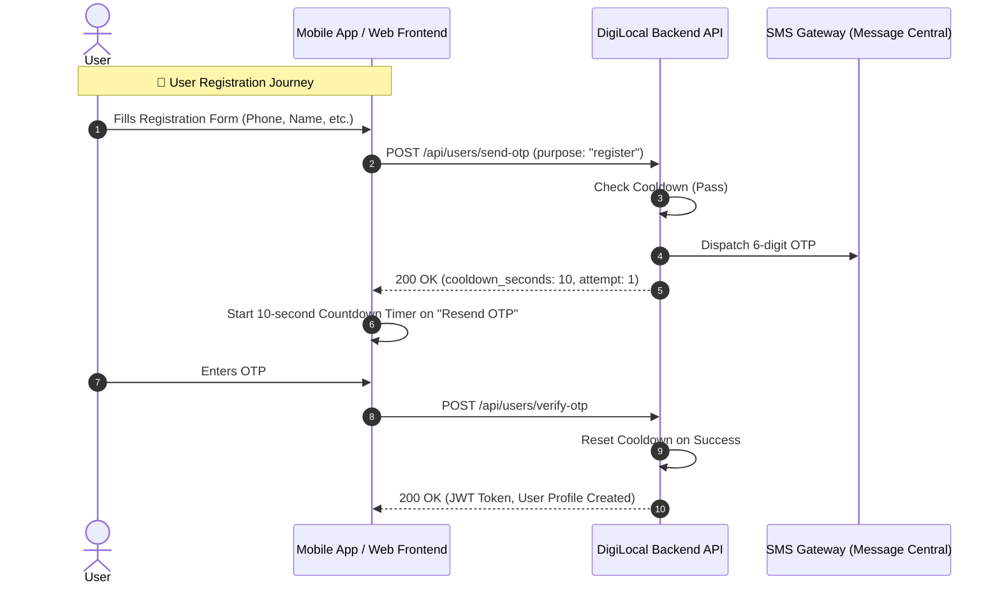
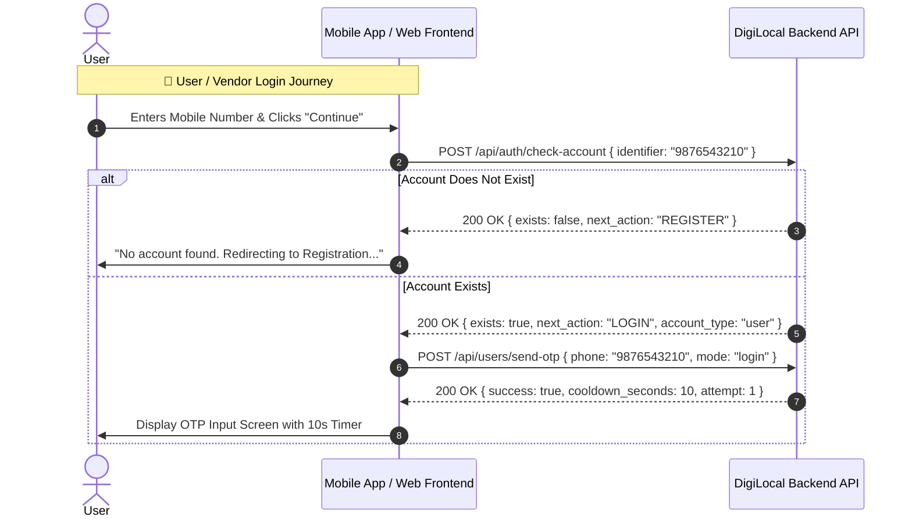

# 📱 DigiLocal — Complete OTP Authentication & Exponential Cooldown API Documentation

> **Target Audience:** Frontend Web Developers (React / Next.js) & Mobile App Developers (Flutter / React Native)  
> **Base URL:** `https://digi-local-backend.onrender.com` (Production) / `http://localhost:5000` (Local)  
> **Version:** 3.5.0  
> **Last Updated:** September 2026  

---

## 📑 Table of Contents
1. [Overview & Core Architecture](#1-overview--core-architecture)
2. [Flow Comparison: Registration vs. Login](#2-flow-comparison-registration-vs-login)
3. [Exponential Progressive OTP Cooldown Feature](#3-exponential-progressive-otp-cooldown-feature)
4. [API Endpoints Reference](#4-api-endpoints-reference)
   - [4.1 Check Account Existence (`POST /api/auth/check-account`)](#41-check-account-existence)
   - [4.2 Send OTP with Cooldown (`POST /api/users/send-otp`)](#42-send-otp-with-cooldown)
   - [4.3 Verify OTP & Authenticate (`POST /api/users/verify-otp`)](#43-verify-otp--authenticate)
   - [4.4 Mobile SMS Provider Endpoints (`POST /api/otp/mobile/*`)](#44-mobile-sms-provider-endpoints)
5. [Status Codes & Error Responses (429 Rate Limiting)](#5-status-codes--error-responses)
6. [Frontend Integration Guide & Code Samples](#6-frontend-integration-guide--code-samples)

---

## 1. Overview & Core Architecture

To prevent unnecessary SMS billing, stop brute-force spamming, and deliver a frictionless user experience, the authentication flow is split into distinct paths:

1. **Pre-flight Check (`check-account`) for Login**: Before triggering an OTP during login, the frontend checks if the user or vendor exists in the database. If not, the UI directs the user to register without triggering an OTP.
2. **Direct OTP Sending for Registration**: When registering a new account, the frontend directly calls the `send-otp` endpoint without requiring a pre-existing account.
3. **Exponential Progressive Cooldown**: Prevents rapid successive OTP requests with progressive wait periods:
   $$\text{Cooldown} = \min(10 \times 2^{(\text{attempt} - 1)},\; 300)\text{ seconds}$$
   - **1st OTP:** 10 seconds wait before resend
   - **2nd OTP:** 20 seconds wait before resend
   - **3rd OTP:** 40 seconds wait before resend
   - **4th OTP:** 80 seconds wait before resend
   - **5th OTP:** 160 seconds wait before resend
   - **6th+ OTP:** Capped at 300 seconds (5 minutes)

---

## 2. Flow Comparison: Registration vs. Login

### 🟢 A. Registration Flow (Direct OTP Dispatch)
When a new user or vendor is signing up:
1. User enters their phone number and registration details.
2. Frontend calls `POST /api/users/send-otp` directly with `"purpose": "register"` (or `"is_registration": true`).
3. Backend verifies that the phone is not under cooldown, sends the OTP, and returns a `10s` initial cooldown timer.
4. User enters the OTP.
5. Frontend calls `POST /api/users/verify-otp`.
6. Backend verifies the OTP and **automatically resets the cooldown back to initial state**.



---

### 🔵 B. Login Flow (Pre-flight Check First)
When an existing user or vendor is logging in:
1. User enters their phone number (or email).
2. Frontend calls `POST /api/auth/check-account` (or `/api/users/check-account`).
3. Backend inspects both `users` and `vendors` tables:
   - **If NOT found (`exists: false`)**: Backend returns `next_action: "REGISTER"`. Frontend alerts the user: *"Account not found. Please sign up first."* **No OTP is sent, saving costs and avoiding confusion.**
   - **If found (`exists: true`)**: Backend returns `next_action: "LOGIN"`, account metadata, and current cooldown status.
4. If found, Frontend proceeds to call `POST /api/users/send-otp` (or `/api/otp/mobile/send-otp`).
5. User inputs OTP $\to$ Frontend calls `POST /api/users/verify-otp` $\to$ Returns access token & profile.



---

## 3. Exponential Progressive OTP Cooldown Feature

### Cooldown Escalation Schedule

| Attempt # | Action Triggered | Wait Required Before Resend | Server Cooldown Header |
| :---: | :---: | :---: | :---: |
| **1st OTP** | Initial send | **10 seconds** | `Retry-After: 10` |
| **2nd OTP** | 1st Resend click | **20 seconds** | `Retry-After: 20` |
| **3rd OTP** | 2nd Resend click | **40 seconds** | `Retry-After: 40` |
| **4th OTP** | 3rd Resend click | **80 seconds** (1 min 20 sec) | `Retry-After: 80` |
| **5th OTP** | 4th Resend click | **160 seconds** (2 min 40 sec) | `Retry-After: 160` |
| **6th+ OTP**| 5th+ Resend click| **300 seconds** (Max Cap: 5 mins) | `Retry-After: 300` |

### Cooldown Reset Rules
- **On Successful Verification:** Cooldown attempt counter and wait timer are immediately wiped (`attempt: 0`).
- **On Inactivity:** If no OTP is requested for 10 consecutive minutes, the counter automatically resets.

---

## 4. API Endpoints Reference

### 4.1 Check Account Existence

Verifies if an account exists across both `users` and `vendors` tables.

- **Method:** `POST`
- **URL:** `/api/auth/check-account`  
  *(Alternative Aliases: `/api/users/check-account`, `/api/users/check-phone`, `/api/auth/check-user`)*
- **Headers:** `Content-Type: application/json`

#### Request Body
```json
{
  "identifier": "9876543210",
  "role": "user"
}
```
| Parameter | Type | Required | Description |
| :--- | :--- | :--- | :--- |
| `identifier` | String | **Yes** | 10-digit mobile number OR email address. Can also use `phone` or `email` as key. |
| `role` | String | No | Filter by role: `'user'`, `'vendor'`, or omit to check all. |

#### Response: Account Found (Proceed to Login)
```json
{
  "success": true,
  "exists": true,
  "account_type": "user",
  "next_action": "LOGIN",
  "message": "Account found. Please proceed to login.",
  "user": {
    "id": 42,
    "name": "Aarav Sharma",
    "email": "aarav@example.com",
    "phone": "9876543210",
    "role": "user",
    "is_verified": true
  },
  "cooldown": {
    "in_cooldown": false,
    "remaining_seconds": 0,
    "next_cooldown_seconds": 10,
    "attempt": 0
  }
}
```

#### Response: Account NOT Found (Proceed to Register)
```json
{
  "success": true,
  "exists": false,
  "account_type": "none",
  "next_action": "REGISTER",
  "message": "No account found with this identifier. Please register.",
  "cooldown": {
    "in_cooldown": false,
    "remaining_seconds": 0,
    "next_cooldown_seconds": 10,
    "attempt": 0
  }
}
```

---

### 4.2 Send OTP with Cooldown

Sends a 6-digit OTP to the phone number. Enforces progressive cooldown.

- **Method:** `POST`
- **URL:** `/api/users/send-otp`  
- **Headers:** `Content-Type: application/json`

#### Request Body (Registration)
```json
{
  "phone": "9876543210",
  "purpose": "register"
}
```

#### Request Body (Login)
```json
{
  "phone": "9876543210",
  "mode": "login"
}
```

| Field | Type | Required | Description |
| :--- | :--- | :--- | :--- |
| `phone` | String | **Yes** | 10-digit mobile number (e.g. `"9876543210"`). |
| `purpose` | String | No | `'register'` or `'login'` (Default: allows auto-dispatch). |
| `mode` | String | No | Optional `'login'` or `'register'`. |

#### Response: Success (200 OK)
```json
{
  "success": true,
  "message": "OTP sent successfully to 9876543210",
  "otp": "459821",
  "cooldown_seconds": 10,
  "resend_available_in_seconds": 10,
  "attempt": 1,
  "next_resend_cooldown_seconds": 20
}
```

#### Response: Cooldown Active (429 Too Many Requests)
Returned if the client attempts to request an OTP before the cooldown expires.
```json
{
  "success": false,
  "error": "Please wait 7 seconds before requesting a new OTP.",
  "retry_after": 7,
  "cooldown_seconds": 10,
  "attempt": 1,
  "message": "Please wait 7 seconds before requesting a new OTP."
}
```

---

### 4.3 Verify OTP & Authenticate

Verifies the submitted 6-digit OTP. Automatically clears cooldown upon success.

- **Method:** `POST`
- **URL:** `/api/users/verify-otp`  
- **Headers:** `Content-Type: application/json`

#### Request Body
```json
{
  "phone": "9876543210",
  "otp": "459821"
}
```

#### Response: Success (200 OK)
```json
{
  "success": true,
  "message": "OTP verified successfully.",
  "token": "eyJhbGciOiJIUzI1NiIsInR5cCI6IkpXVCJ9...",
  "user": {
    "user_id": 42,
    "name": "Aarav Sharma",
    "phone": "9876543210",
    "email": "aarav@example.com",
    "is_verified": true
  }
}
```

#### Response: Invalid or Expired OTP (400 Bad Request)
```json
{
  "success": false,
  "message": "Invalid OTP. Please check the code and try again."
}
```

---

### 4.4 Mobile SMS Provider Endpoints

For direct SMS Gateway (Message Central) integrations used by the Vendor Website and Vendor App:

#### 1. Send SMS OTP: `POST /api/otp/mobile/send-otp`
- **Body:**
  ```json
  {
    "phone": "9876543210",
    "role": "vendor",
    "purpose": "register"
  }
  ```
- **Returns 200:** Includes `cooldown_seconds: 10`, `attempt: 1`, `next_resend_cooldown_seconds: 20`.
- **Returns 429:** When called within cooldown with `retry_after`.

#### 2. Verify SMS OTP: `POST /api/otp/mobile/verify-otp`
- **Body:**
  ```json
  {
    "phone": "9876543210",
    "otp": "459821",
    "role": "vendor"
  }
  ```
- **Returns 200:** Resets cooldown and returns tokens (`token`, `refreshToken`, `vendor` profile).

---

## 5. Status Codes & Error Responses

| HTTP Status | Meaning | Scenario | Frontend Handling |
| :---: | :---: | :---: | :---: |
| `200 OK` | Success | OTP sent or verified successfully | Start timer or save token and navigate |
| `400 Bad Request` | Missing/Invalid Input | Invalid phone format or wrong OTP | Display inline error message |
| `404 Not Found` | Not Found | Login attempted for unregistered number | Redirect user to registration screen |
| `429 Too Many Requests` | Cooldown Active | OTP resend clicked before wait time | Show countdown alert with `retry_after` seconds |
| `500 Server Error` | Server Exception | Network or database issue | Show retry dialog |

---

## 6. Frontend Integration Guide & Code Samples

### ⚛️ React / React Native Hook for Resend Timer

```typescript
import React, { useState, useEffect } from 'react';
import axios from 'axios';

export const useOtpCooldown = () => {
  const [cooldown, setCooldown] = useState<number>(0);
  const [canResend, setCanResend] = useState<boolean>(true);

  useEffect(() => {
    if (cooldown <= 0) {
      setCanResend(true);
      return;
    }

    setCanResend(false);
    const interval = setInterval(() => {
      setCooldown((prev) => (prev > 0 ? prev - 1 : 0));
    }, 1000);

    return () => clearInterval(interval);
  }, [cooldown]);

  const triggerCooldown = (seconds: number) => {
    setCooldown(seconds);
    setCanResend(false);
  };

  return { cooldown, canResend, triggerCooldown };
};
```

### 📱 Full Login vs. Registration Handling (TypeScript)

```typescript
const BASE_URL = 'https://digi-local-backend.onrender.com';

// 1. LOGIN HANDLER: Check existence first!
async function handleLoginSubmit(phoneNumber: string) {
  try {
    // Step 1: Pre-flight check
    const checkRes = await axios.post(`${BASE_URL}/api/auth/check-account`, {
      identifier: phoneNumber,
      role: 'user'
    });

    if (!checkRes.data.exists) {
      alert('No account found with this number. Please register first.');
      navigateToRegistrationScreen({ phone: phoneNumber });
      return;
    }

    // Step 2: Send OTP
    const otpRes = await axios.post(`${BASE_URL}/api/users/send-otp`, {
      phone: phoneNumber,
      mode: 'login'
    });

    // Start progressive cooldown timer (e.g. 10s, 20s, 40s...)
    triggerCooldown(otpRes.data.cooldown_seconds || 10);
    navigateToOtpVerificationScreen();

  } catch (error: any) {
    if (error.response?.status === 429) {
      const waitSec = error.response.data.retry_after;
      triggerCooldown(waitSec);
      alert(`Please wait ${waitSec} seconds before resending OTP.`);
    } else {
      alert(error.response?.data?.message || 'Failed to send OTP.');
    }
  }
}

// 2. REGISTRATION HANDLER: Send OTP Directly!
async function handleRegistrationSubmit(registrationData: { phone: string; name: string }) {
  try {
    // Send OTP directly without pre-check
    const otpRes = await axios.post(`${BASE_URL}/api/users/send-otp`, {
      phone: registrationData.phone,
      purpose: 'register'
    });

    // Start 10s cooldown timer
    triggerCooldown(otpRes.data.cooldown_seconds || 10);
    navigateToOtpVerificationScreen();

  } catch (error: any) {
    if (error.response?.status === 429) {
      const waitSec = error.response.data.retry_after;
      triggerCooldown(waitSec);
      alert(`Please wait ${waitSec} seconds before resending OTP.`);
    } else {
      alert(error.response?.data?.message || 'Error sending registration OTP.');
    }
  }
}

// 3. RESEND OTP HANDLER
async function handleResendOtp(phoneNumber: string, purpose: 'login' | 'register') {
  try {
    const res = await axios.post(`${BASE_URL}/api/users/send-otp`, {
      phone: phoneNumber,
      purpose: purpose
    });

    // Next cooldown will be longer (10s -> 20s -> 40s -> 80s)
    triggerCooldown(res.data.cooldown_seconds);
    alert(`New OTP sent! Next resend available in ${res.data.cooldown_seconds}s`);

  } catch (error: any) {
    if (error.response?.status === 429) {
      const waitSec = error.response.data.retry_after;
      triggerCooldown(waitSec);
      alert(`Too fast! Please wait ${waitSec}s.`);
    }
  }
}
```

---

## 7. Summary Checklist for Frontend & Mobile Teams

- [x] **Login Screen:** Call `POST /api/auth/check-account` before sending OTP. If `exists === false`, stop and route to Register.
- [x] **Registration Screen:** Call `POST /api/users/send-otp` directly with `"purpose": "register"`.
- [x] **Resend OTP Button:** Always disable when `cooldown > 0`. Label button as `Resend OTP in 10s`, `Resend OTP in 20s`, etc.
- [x] **HTTP 429 Interceptor:** Capture `429` status code and dynamically update countdown to `response.data.retry_after`.
- [x] **Verification Success:** OTP verified $\to$ Cooldown automatically reset to initial 10s.
